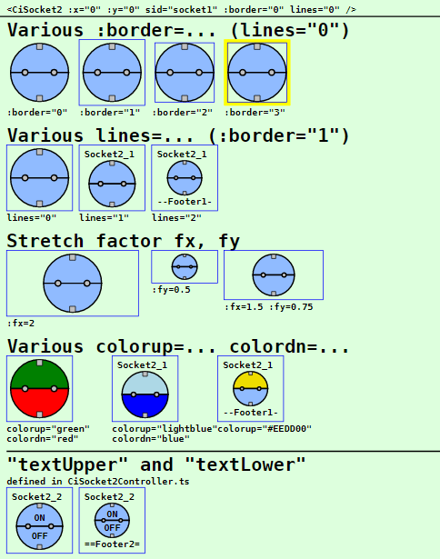
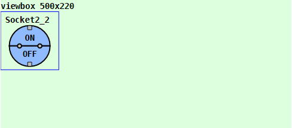
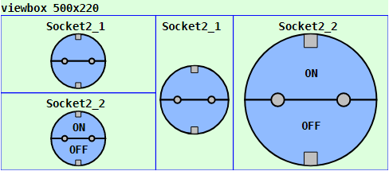

Letzte &Auml;nderung: 30.1.2023 <a name="up"></a>   
<table><tr><td></img></td><td>
<h1>Vue: Verwendung des CiSocket2-Symbols</h1>
<a href="../../LIESMICH.md">==> Startseite</a> &nbsp; &nbsp; &nbsp; 
<a href="./README.md">==> English version</a> &nbsp; &nbsp; &nbsp; 
</td></tr></table><hr>
  
# Ziel
Kennenlernen aller M&ouml;glichkeiten zur Darstellung und Verwendung eines `CiSocket2`-Symbols.   
Allgemein gilt:   
* Klickt man auf die obere H&auml;lfte des `CiSocket2`-Symbols, so wird eine erste MQTT-Nachricht ausgesendet (zB "Ein").   
* Klickt man auf die untere H&auml;lfte des `CiSocket2`-Symbols, so wird eine andere MQTT-Nachricht ausgesendet (zB "Aus").   
* Alle Eigenschaften, die die grafische Darstellung des Symbols betreffen, werden im `<template>`-Bereich der Darstellungsdatei (zB in `CiMain.vue`) festgelegt.   
* Alle nicht grafischen Eigenschaften, wie ID, Name, Beschriftungen und MQTT-Funktionalit&auml;t, werden in der Datei `CiSocket2Controller.ts` definiert.   

# Kurzanleitung
* Verzeichnis `vuex140_ci_mqtt_socket2` herunterladen.   
* Visual Studio Code (VSC) starten und den Ordner dieser Vue-Anwendung &ouml;ffnen.   
* In VSC das Terminal &ouml;ffnen und folgendes eingeben:   
`npm run serve`   
* Den Browser (zB Google Chrome) starten und die Seite `localhost:8080` aufrufen.   

Im Browser werden die im _Bild 1_ (siehe unten) dargestellten Symbole angezeigt.   

Will man die MQTT-Funktionalit&auml;t testen, so muss auf einem Rechner (bzw. Raspberry Pi) mit der IP-Adresse `10.1.1.1` ein MQTT-Broker laufen (zB Mosquitto).   
* Entwicklungsrechner mit dem Netzwerk des Broker-Servers verbinden. (Bei WLAN zB SSID `Raspi11`, Passwort `12345678`)   
* Windows-Konsole (`cmd.exe`) starten, ins mosquitto-Verzeichnis wechseln und folgendes eingeben:   
`mosquitto_sub -h 10.1.1.1 -t "#" -v`   
* Dr&uuml;ckt man im Browser auf die obere H&auml;lfte des Sockets, so werden eine bzw. mehrere MQTT-Nachrichten gesendet, die in der Konsole zu sehen sind, zB.   
`ci/socket2/2/set/socket2 {"POWER":"ON"}`   
`ci/socket2/set {"POWER":"ON"}`   
* Dr&uuml;ckt man im Browser auf die untere H&auml;lfte des Sockets, so werden eine bzw. mehrere MQTT-Nachrichten gesendet, die in der Konsole zu sehen sind, zB.   
`ci/socket2/2/set/socket2 {"POWER":"OFF"}`   
`ci/socket2/set {"POWER":"OFF"}`   

Anmerkung: Eine detaillierte Beschreibung zu einzelnen Schritten befindet sich in anderen Kapiteln des Projektes MQTT4HOME.

# Grafische Darstellung eines Symbols
## Allgemeines
Die Codierung der grafischen Darstellung eines CI-Symbols `CiXxx` erfolgt in einer Datei mit dem Namen wie `CiXxx.vue`. Diese Dateien werden dann von der eigentlichen Projektdatei (zB. `CiMain.vue`) verwendet, um die Web-Seite darzustellen.   
Das folgende Bild zeigt die Ausgabe dieser Vue-Anwendung mit den verschiedenen `CiSocket2`-Darstellungen. Welche Attribute welche Darstellung bewirken, wird anschlie&szlig;end beschrieben.     
   
_Bild 1: Beispiele f&uuml;r verschiedene CiSocket2-Darstellungen_   

## Socket2-Aufruf
Die Verwendung eines Socket2-Symbols erfolgt im `<template>`-Bereich der Darstellungsdatei (zB in `CiMain.vue`) durch das Tag `<CiSocket2>` und weiteren Attributen.   
_Beispiel_:   
```   
<CiSocket2 :x="50" :y="70" sid="socket1" :border="3" lines="0" :fx="2" :fy="1.5"></CiSocket2>
```   

## Positionierung eines Symbols (x, y)
Im Normalfall sind CI-Symbole 100x100 Einheiten gro&szlig; und der Mittelpunkt (50/50) dient zur Positionsangabe (Platzierungspunkt). Ist der Zeichenbereich zB durch   
`<svg width="100%" viewBox="0 0 500 220">`   
definiert, so bewirkt die Ortsangabe `:x="50" :y="70"`, dass der Socket an den linken Rand grenzt und 20 Einheiten vom oberen Rand entfernt ist:   
   
_Bild 2: Ort eines Sockets_   

_Anmerkung_:   
Restlicher Platz unten: 220 - 20 - 100 = 100 Einheiten   
Restlicher Platz rechts: 500 - 100 = 400 Einheiten   

## ID eines Symbols (sid)
Die Symbol-ID (sid) stellt die Verbindung zwischen der grafischen Darstellung und dem Controller dar (siehe Eigenschaft [id](#id) im Kapitel "[Im Basis-Controller definierte Attribute](#id)")

## Rand eines Symbols (border)
Alle CI-Symbole sind im Normalfall au&szlig;en 100x100 Einheiten gro&szlig; und haben nach innen einen fixen Rand von 5 Einheiten. Die individuelle "Arbeitsfl&auml;che" eines Symbols ist also 90 x 90 Einheiten gro&szlig;.   
Durch den Rand ist es m&ouml;glich, Symbole direkt nebeneinander in einem 100er-Raster anzuordnen, ohne dass sich die Symbol-Zeichnungen optisch ber&uuml;hren.   
Will man den Rand eines CI-Symbols darstellen, so gibt es dazu vier M&ouml;glichkeiten, die &uuml;ber das Attribut `:border=` eingestellt werden:   

| Parameter     | Bedeutung                      |   
| ------------- | ------------------------------ |   
| `:border="0"` | Es wird kein Rand dargestellt. |   
| `:border="1"` | Es wird nur der &auml;u&szlig;ere Rand des Symbols dargestellt (= gesamter Platzbedarf des Symbols). |   
| `:border="2"` | Es wird nur der innere Rand des Symbols dargestellt (= der Zeichenbereich f&uuml;r das Symbol). |   
| `:border="3"` | Es wird der Rand des Symbols gelb angezeigt. |   

Vorgabe ist `:border="1"`   

## Textangaben im CiSocket2-Symbol (lines)
Jedes `CiSocket2`-Symbol kennt vier m&ouml;gliche Bereiche zur Textausgabe:   
* Kopfzeile   
* Fu&szlig;zeile   
* Obere Beschriftung   
* Untere Beschriftung   

Welche Texte im Symbol wirklich angezeigt werden, h&auml;ngt vom Wert des Attributs `lines=` ab:    
| Parameter     | Bedeutung                      |   
| ------------- | ------------------------------ |   
| `lines="0"`   | Weder Kopfzeile noch Fu&szlig;zeile werden angezeigt. |   
| `lines="1"`   | Die Kopfzeile wird angezeigt. Ist im Controller der Parameter `name` definiert, so wird dieser Text angezeigt, ansonsten die `id`. |   
| `lines="2"`   | Kopf- und Fu&szlig;zeile werden angezeigt.<br>Kopfzeile: Ist im Controller der Parameter `name` definiert, so wird dieser Text angezeigt, ansonsten die `id`.<br>Fu&szlig;zeile: Ist im Controller der Parameter `textFooter` definiert, so wird dieser Text angezeigt, ansonsten der Wert von `battery` oder, falls `battery` nicht definiert ist, die `id`. |   

Vorgabe ist `lines="1"`   

Je nach Anzahl angezeigter Zeilen ver&auml;ndert sich die Gr&ouml;&szlig;e des Zeichenbereichs f&uuml;r das CI-Symbol. F&uuml;r das Standard-Symbol mit der Gesamtgr&ouml;&szlig;e 100x100 gilt:   
* `lines="0"`: Zeichenbereich 90x90 Einheiten   
* `lines="1"`: Zeichenbereich 90x72 Einheiten   
* `lines="2"`: Zeichenbereich 90x54 Einheiten   

Einen Sonderfall stellen die Beschriftungstexte oben und unten im Socket-Symbols dar. Die Anzeige dieser Texte ist unabh&auml;ngig vom Wert des `lines`-Parameters. Sind Werte f&uuml;r die Parameter `textUpper` und `textUpper` in der Datei `CiSocket2Controller.ts` definiert, so werden diese Text auf jeden Fall angezeigt.   

## Strecken eines Symbols (fx, fy)
Standardm&auml;&szlig;ig sind alle Symbole 100x100 Einheiten gro&szlig;. Es ist jedoch m&ouml;glich, die Symbole in x- und in y-Richtung zu strecken. Der Platzierungspunkt bleibt dabei gleich.   
Das Strecken erfolgt durch Angabe der Parameter `fx` und `fy`, wie das folgende Beispiel zeigt:   
   
_Bild 3: Gestreckter Socket2_   

Die linken beiden socket2-Symbole sind um den Faktor fx=2 gestreckt (ergibt 2*100 =  200 Einheiten), das dritte Symbol ist um den Faktor fy=2 gesteckt und das rechte Symbol ist um fx=2 und fy=2 gestreckt, d.h., es ist mit einer Gr&ouml;&szlig;e von 200x200 doppelt so gro&szlig; wie das Original.   
__Codierungsbeispiel__:   
```   
<template>
<svg width="100%" viewBox="0 0 500 220">
  <rect class="ciBackground" x="0" y="0" width="500" height="220" />
  <text x="0" y="15" class="ciFont1">viewbox 500x220</text>
  <CiSocket2 :x="50" :y="70" sid="socket1" :fx="2" :fy="1"></CiSocket2>
  <CiSocket2 :x="50" :y="170" sid="socket2" :fx="2" :fy="1"></CiSocket2>
  <CiSocket2 :x="250" :y="70" sid="socket1" :fx="1" :fy="2"></CiSocket2>
  <CiSocket2 :x="350" :y="70" sid="socket2" :fx="2" :fy="2"></CiSocket2>
</svg>
</template>
```   

## Farbe des Sockets (color)
Mit Hilfe der Attribute `colorup=` und `colordn=` kann die Farbe des oberen bzw. unteren `CiSocket2`-Symbols gew&auml;hlt werden. Der Wert kann entweder ein RGB-Wert (rot-gr&uuml;n-blau-Wert), wie zB `#ffee00` oder eine Textangabe wie `red`, `green` etc. sein.   
Wird kein Wert angegeben, ist die Farbe hellblau (entsprechend der Konstanten `colorUnknown` aus der Datei `Geo.ts`).   
Die `CiSocket2`-Farben k&ouml;nnen auch &uuml;ber empfangene MQTT-Nachrichten ver&auml;ndert werden, was &uuml;ber die Variable `iSocket2State` gesteuert werden kann. Dazu muss die Codierung der Methoden `onMessage` (in der Datei `CiSocket2Controller.ts`) und `colorUpper` bzw. `colorLower` (in der Datei `CiSocket2.vue`) angepasst werden.   

<a name="id"></a>   
# Nicht-grafische Eigenschaften
## Im Basis-Controller definierte Attribute
Eigenschaften von CI-Symbolen, die nichts mit der grafischen Darstellung des Symbols zu tun haben, werden in "`xxxController.ts`"-Dateien definiert.   
Folgende Attribute sind im Basis-Controller (Datei `CiBaseController.ts`) definiert und m&uuml;ssen in allen abgeleiteten Controllern zwingend angegeben werden:   
| Eigenschaft  | Bedeutung                                |   
| ------------ | ---------------------------------------- |   
| `id`         | Sollte im Normalfall eine eindeutige Bezeichnung eines socket2-Symbols sein.    |   
| `subTopic`   | Nachrichten bzw. MQTT-Topics, auf die Socket2 "h&ouml;rt" (kann auch leer '' sein). |   
| `pubTopic`   | MQTT-Topics, die Socket2 beim Klicken sendet. |   

Folgende Attribute sind optional:   
| Eigenschaft  | Bedeutung                            |   
| ------------ | ------------------------------------ |   
| `name`       | Name eines Socket2. Kann in der Kopfzeile des Symbols angezeigt werden. |   
| `pubPayload` | Payload, die beim Dr&uuml;cken der oberen H&auml;lfte des Socket2 versendet wird. |   


## In `CiSocket2Controller.ts` definierte Eigenschaften
Folgende Attribute sind zwingend anzugeben:   
| Eigenschaft     | Bedeutung                            |   
| --------------- | ------------------------------------ |   
| `iSocket2State` | Status des Socket2. Als Vorgabe f&uuml;r den Start zB -99 verwenden. |   
| `type`          | Typ des socket2-Elements. Je nach Hardware-Type kann auf empfangene MQTT-Nachrichten entsprechend reagiert werden.  |   

Folgende Attribute sind optional und k&ouml;nnen verwendet werden:   
| Eigenschaft  | Bedeutung                            |   
| ------------ | ------------------------------------ |   
| `battery`      | Empfang des Ladezustands, falls ein socket2-Symbol mit Batterie betrieben wird. Kann in der Fu&szlig;zeile angezeigt werden. |   
| `textUpper`   | Text in der oberen Symbolh&auml;lfte, zB "ein". |   
| `textLower`   | Text in der unteren Symbolh&auml;lfte, zB "aus". |   
| `textFooter`   | Angabe eines fixen Textes in der Fu&szlig;zeile. |   
| `pubPayloadLower` | Payload, die beim Dr&uuml;cken der unteren H&auml;lfte des Sockets versendet wird. |   

## Beispiel: Codierung des `CiSocket2Controller.ts`   
Im Normalfall m&uuml;ssen nur die Werte innerhalb des Bereichs `Array<Socket2>` erg&auml;nzt werden.   
M&ouml;chte man zus&auml;tzliche MQTT-Funktionalit&auml;ten beim Empfang von Nachrichten implementieren, so kann der Code in der Methode `public onMessage (message: Message): void` entsprechend erg&auml;nzt werden.   

Als Beispiel enth&auml;lt der unten stehende Code eine Reaktion auf das Topic `ci/socket2/set`. L&auml;uft ein MQTT-Server auf einem Rechner oder Raspberry Pi mit der IP 10.1.1.1, so bewirkt   
* das Dr&uuml;cken der oberen H&auml;lfte eines Sockets mit der id `socket1` ein Aussenden der Nachrichten mit dem Topic `ci/socket2/1/set/socket2` sowie `ci/socket2/set` und der Payload `{"POWER":"1"}`. Die zweite Nachricht wird von Sockets mit der ID `socket1` und `socket2` empfangen und die obere Socket-H&auml;lfte "gelb" sowie die untere H&auml;lfte "grau" eingef&auml;rbt. 
* das Dr&uuml;cken der unteren H&auml;lfte eines Sockets mit der id `socket1` ein Aussenden der Nachrichten mit dem Topic `ci/socket2/1/set/socket2` sowie `ci/socket2/set` und der Payload `{"POWER":"0"}`. Die zweite Nachricht wird von Sockets mit der ID `socket1` und `socket2` empfangen und die obere Socket-H&auml;lfte "grau" sowie die untere H&auml;lfte "gelb" eingef&auml;rbt.   

```
// ______CiSocket2Controller.ts__________________khartinger_____
// 2022-08-07: new
// 2023-01-29: change at CiBase (add Geo.ts)
import { reactive } from 'vue'
import { Message } from '@/services/CiMqttClient'
import { CiBaseController, IBase } from './CiBaseController'

export interface Socket2 extends IBase {
  iSocket2State: number;
  type: string;
  battery?: string;
  textUpper?: string;
  textLower?: string;
  textFooter?: string;
  pubPayloadLower?: string;
  // Note: default pubPayload means pubPayloadUpper!
}

export class CiSocket2Controller extends CiBaseController {
  public sockets2: Array<Socket2> = reactive(
    [
      {
        id: 'socket1',
        name: 'Socket2_1',
        iSocket2State: -99,
        type: 'delock11826',
        // textUpper: 'ON',
        // textLower: 'OFF',
        textFooter: '--Footer1--',
        subTopic: 'ci/socket2/1/ret ci/socket2/set',
        pubTopic: 'ci/socket2/1/set/socket2 ci/socket2/set',
        pubPayload: '{"POWER":"1"}',
        pubPayloadLower: '{"POWER":"0"}'
      },
      {
        id: 'socket2',
        name: 'Socket2_2',
        iSocket2State: -99,
        type: 'delock11826', // e1603=IKEA
        textUpper: 'ON',
        textLower: 'OFF',
        textFooter: '==Footer2==',
        subTopic: 'ci/socket2/2/ret ci/socket2/set',
        pubTopic: 'ci/socket2/2/set/socket2 ci/socket2/set',
        pubPayload: '{"POWER":"ON"}',
        pubPayloadLower: '{"POWER":"OFF"}'
      }
    ]
  );

  public onMessage (message: Message): void {
    this.sockets2.forEach(socket2 => {
      const aSubTopic = socket2.subTopic.split(' ')
      if (aSubTopic.includes(message.topic)) {
        // ---socket2 found ------------------------------------
        if (socket2.type === 'delock11826') {
          const aPayload = JSON.parse(message.payload)
          if ((aPayload.POWER === 'ON') || (aPayload.POWER === '1')) socket2.iSocket2State = -1
          else {
            if ((aPayload.POWER === 'OFF') || (aPayload.POWER === '0')) socket2.iSocket2State = -2
            else { socket2.iSocket2State = -9 }
          }
        }
        // ---end socket2 found---------------------------------
      }
    })
  }

  public publishCi (topic: string, payload: string): void {
    // console.log('CiSocket1Controller:publishCi:', '-t ' + topic + ' -m ' + payload)
    this.publish(topic, payload, false, 0).catch((e) => { console.error('CiSocketController: ERROR:', e) })
  }
}

export const ciSocket2Controller = new CiSocket2Controller()
```

[Zum Seitenanfang](#up)
