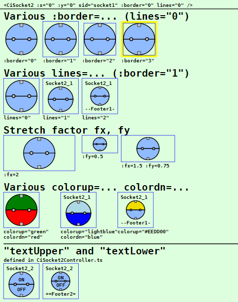
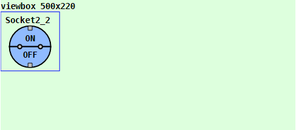
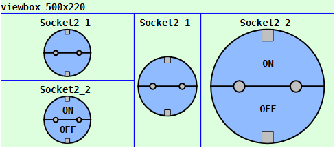

Last modified: 2023-01-30 <a name="up"></a>   
<table><tr><td></td><td>
<h1>Vue: Using the CiSocket2 symbol</h1>
<a href="../../README.md">==> Home page</a> &nbsp; &nbsp; &nbsp; 
<a href="./LIESMICH.md">==> German version</a> &nbsp; &nbsp; &nbsp; 
</td></tr></table><hr>

# Target
Getting to know all the ways to display and use a `CiSocket2` symbol.   
In general:   
* If you click on the upper half of the `CiSocket2` symbol, a first MQTT message is sent out (e.g. "On").   
* If you click on the lower half of the `CiSocket2` symbol, another MQTT message is sent out (e.g. "Off").   
* All properties concerning the graphical representation of the symbol are set in the `<template>` area of the representation file (e.g. in `CiMain.vue`).   
* All non-graphical properties, such as ID, name, labels and MQTT functionality, are defined in the `CiSocket2Controller.ts` file.   

# Quick Reference
* Download directory `vuex140_ci_mqtt_socket2`.   
* Start Visual Studio Code (VSC) and open the folder of this Vue application.   
* In VSC open the terminal and type the following:   
`npm run serve`   
* Start the browser (e.g. Google Chrome) and call the page `localhost:8080`.   

In the browser the symbols shown in _Fig. 1_ (see below) are displayed.   

If you want to test the MQTT functionality, you have to run an MQTT broker (e.g. Mosquitto) on a computer (or Raspberry Pi) with the IP address `10.1.1.1`.   
* Connect the development computer to the network of the broker server. (For WLAN e.g. SSID `Raspi11`, password `12345678`)   
* Start Windows console (`cmd.exe`), change to the mosquitto directory and enter the following:   
`mosquitto_sub -h 10.1.1.1 -t "#" -v`   
* If you press the upper half of the socket in the browser, one or more MQTT messages are sent, which can be seen in the console, e.g.   
`ci/socket2/2/set/socket2 {"POWER":"ON"}`   
`ci/socket2/set {"POWER":"ON"}`   
* If you press the lower half of the socket in the browser, one or more MQTT messages are sent, which can be seen in the console, e.g.   
`ci/socket2/2/set/socket2 {"POWER":"OFF"}`   
`ci/socket2/set {"POWER":"OFF"}`   

Note: A detailed description of individual steps can be found in other chapters of the MQTT4HOME project.

## Graphic representation of a symbol
## General
The coding of the graphical representation of a CI symbol `CiXxx` is done in a file with a name like `CiXxx.vue`. These files are then used by the actual project file (e.g. `CiMain.vue`) to display the web page.   
The following image shows the output of this Vue application with the different `CiSocket2` representations. Which attributes cause which representation is described afterwards.     
   
_Fig. 1: Examples for different CiSocket2 representations_.   

## Socket2 call
The use of a Socket2 symbol takes place in the `<template>` area of the presentation file (e.g. in `CiMain.vue`) by the tag `<CiSocket2>` and further attributes.   
_Example_:   
```   
<CiSocket2 :x="50" :y="70" sid="socket1" :border="3" lines="0" :fx="2" :fy="1.5"></CiSocket2>
```   

## Positioning of a symbol (x, y)
Normally CI symbols are 100x100 units in size and the center point (50/50) is used to indicate the position (placement point). If the drawing area is defined e.g. by   
`<svg width="100%" viewBox="0 0 500 220">`   
then the location specification `:x="50" :y="70"` causes the socket to border the left edge and be 20 units away from the top edge:   
   
_Fig. 2: Location of a socket_   

_Note_:   
Remaining space at the bottom: 220 - 20 - 100 = 100 units.   
Remaining space right: 500 - 100 = 400 units   

## ID of a symbol (sid)
The symbol ID (sid) represents the connection of the graphical representation to the controller (see property [id](#id) in chapter "[Attributes defined in the base controller](#id)").

## Border of a symbol (border)
All CI symbols are normally 100x100 units on the outside and have a fixed margin of 5 units on the inside. So the individual "workspace" of a symbol is 90x90 units.   
The margin makes it possible to arrange symbols directly next to each other in a 100-unit grid without the symbol drawings visually touching each other.   
If you want to display the border of a CI symbol, there are four possibilities for this, which are set via the attribute `:border=`:   

| Parameter | Meaning |   
| ------------- | ------------------------------ |   
| `:border="0"` | No border will be displayed. |   
| `:border="1"` | Only the outer border of the symbol is displayed (= total space required by the symbol). |   
| `:border="2"` | Only the inner border of the symbol is shown (= the drawing area for the symbol). |   
| `:border="3"` | The border of the symbol is displayed in yellow. |   

Default is `:border="1"`.   

## Text information in CiSocket2 symbol (lines)
Each `CiSocket2` symbol knows four possible areas for text output:   
* header   
* footer   
* Upper Label   
* Lower Label   

Which texts are actually displayed in the symbol depends on the value of the 'lines=' attribute:    
| parameter | meaning |   
| ------------- | ------------------------------ |   
| `lines="0"`   | Neither header nor footer will be displayed. |   
| `lines="1"`   | The header line is displayed. If the `name` parameter is defined in the controller, this text is displayed, otherwise the `id`. |   
| `lines="2"`   | Header and footer are displayed.<br>Header: If the parameter `name` is defined in the controller, this text is displayed, otherwise the `id`.<br>Footer: If the `textFooter` parameter is defined in the controller, this text is displayed, otherwise the value of `battery` or, if `battery` is not defined, the `id`. |  

Default is `lines="1"`.   

Depending on the number of displayed lines, the size of the drawing area for the CI symbol changes. For the standard symbol with the total size 100x100 applies:   
* `lines="0"`: character area 90x90 units   
* `lines="1"`: drawing area 90x72 units   
* `lines="2"`: drawing area 90x54 units   

The caption texts at the top and bottom of the socket symbol are a special case. The display of these texts is independent of the value of the `lines` parameter. If values for the `textUpper` and `textUpper` parameters are defined in the `CiSocket2Controller.ts` file, these texts are displayed in any case.   

## Stretching of a symbol (fx, fy)
By default, all symbols are 100x100 units in size. However, it is possible to stretch the symbols in x and in y direction. The placement point remains the same.   
Stretching is done by specifying the parameters `fx` and `fy`, as the following example shows:   
   
_Fig. 3: Stretched socket2_   

The left two socket2 symbols are stretched by the factor fx=2 (results in 2*100 = 200 units), the third symbol is stretched by the factor fy=2 and the right symbol is stretched by fx=2 and fy=2, i.e. it is twice as large as the original with a size of 200x200.   
__Coding example__:   
```   
<template>
<svg width="100%" viewBox="0 0 500 220">
  <rect class="ciBackground" x="0" y="0" width="500" height="220" />
  <text x="0" y="15" class="ciFont1">viewbox 500x220</text>
  <CiSocket2 :x="50" :y="70" sid="socket1" :fx="2" :fy="1"></CiSocket2>
  <CiSocket2 :x="50" :y="170" sid="socket2" :fx="2" :fy="1"></CiSocket2>
  <CiSocket2 :x="250" :y="70" sid="socket1" :fx="1" :fy="2"></CiSocket2>
  <CiSocket2 :x="350" :y="70" sid="socket2" :fx="2" :fy="2"></CiSocket2>
</svg>
</template>
```   

## Color of the socket (color)
With the help of the attributes `colorup=` and `colordn=` the color of the upper and lower `CiSocket2` symbol can be selected. The value can either be an RGB value (red-green-blue value) like `#ffee00` or a text value like `red`, `green` etc..   
If no value is given, the color is light blue (according to the constant `colorUnknown` from the file `Geo.ts`).   
The `CiSocket2` colors can also be changed over received MQTT messages, which can be controlled over the variable `iSocket2State`. For this the coding of the methods `onMessage` (in the file `CiSocket2Controller.ts`) and `colorUpper` or `colorLower` (in the file `CiSocket2.vue`) must be adapted.   

<a name="id"></a>   
# Non-graphical attributes
## Attributes defined in the base controller.
Attributes of CI symbols that have nothing to do with the graphical representation of the symbol are defined in "`xxxController.ts`" files.   
The following attributes are defined in the base controller (`CiBaseController.ts` file) and must be mandatory in all derived controllers:   
| Property | Meaning |   
| ------------ | ---------------------------------------- |   
| `id` | Should normally be a unique name of a socket2.    |   
| `subTopic` | Messages or MQTT topics the socket2 "listens" to (can also be empty ''). |   
| `pubTopic` | MQTT topics that the socket2 sends when clicked. |   

The following attributes are optional:   
| property | meaning |   
| ------------ | ------------------------------------ |   
| `name` | Name of a socket2. Can be displayed in the header of the icon. |   
| `pubPayload` | Payload sent when the upper half of the socket2 is pressed. |   


## Attributes defined in `CiSocket2Controller.ts`.
The following attributes are mandatory:   
| Property        | Meaning |   
| --------------- | ------------------------------------ |   
| `iSocket2State` | Status of the socket2. Use e.g. -99 as default for the start. |   
| `type`          | Type of the socket2 element. Depending on the hardware type, received MQTT messages can be responded to accordingly. |   

The following attributes are optional and can be used:   
| property | meaning |   
| ------------ | ------------------------------------ |   
| `battery` | Receive the state of charge if a socket2 is operated with battery. Can be displayed in the footer. |   
| `textUpper` | Text in the upper half of the symbol, e.g. "on". |   
| `textLower` | Text in the lower half of the symbol, e.g. "off". |   
| `textFooter` | Specify a fixed text in the footer. |   
| `pubPayloadLower` | Payload that will be sent when the lower half of the socket is pressed. |  

## Example: Coding of the `CiSocket2Controller.ts`.   
Normally only the values inside the `Array<Socket2>` area need to be added.   
If you want to implement additional MQTT functionality when receiving messages, the code in the method `public onMessage (message: Message): void` can be extended accordingly.   

As an example, the code below contains a response to the topic `ci/socket2/set`. If an MQTT server is running on a computer or Raspberry Pi with the IP 10.1.1.1, then   
* pressing of the upper half of a socket with the id `socket1` causes a sending of messages with the topic `ci/socket2/1/set/socket2` as well as `ci/socket2/set` and the payload `{"POWER":"1"}`. The second message is received from sockets with the ID `socket1` and `socket2` and the upper half of the socket is colored "yellow" and the lower half "gray". 
* pressing the lower half of a socket with the id `socket1` a sending a message with the topic `ci/socket2/1/set/socket2` as well as `ci/socket2/set` and the payload `{"POWER":"0"}`. The second message is received by sockets with the ID `socket1` and `socket2` and the upper half of the socket is colored "gray" and the lower half "yellow".   

```
// ______CiSocket2Controller.ts__________________khartinger_____
// 2022-08-07: new
// 2023-01-29: change at CiBase (add Geo.ts)
import { reactive } from 'vue'
import { Message } from '@/services/CiMqttClient'
import { CiBaseController, IBase } from './CiBaseController'

export interface Socket2 extends IBase {
  iSocket2State: number;
  type: string;
  battery?: string;
  textUpper?: string;
  textLower?: string;
  textFooter?: string;
  pubPayloadLower?: string;
  // Note: default pubPayload means pubPayloadUpper!
}

export class CiSocket2Controller extends CiBaseController {
  public sockets2: Array<Socket2> = reactive(
    [
      {
        id: 'socket1',
        name: 'Socket2_1',
        iSocket2State: -99,
        type: 'delock11826',
        // textUpper: 'ON',
        // textLower: 'OFF',
        textFooter: '--Footer1--',
        subTopic: 'ci/socket2/1/ret ci/socket2/set',
        pubTopic: 'ci/socket2/1/set/socket2 ci/socket2/set',
        pubPayload: '{"POWER":"1"}',
        pubPayloadLower: '{"POWER":"0"}'
      },
      {
        id: 'socket2',
        name: 'Socket2_2',
        iSocket2State: -99,
        type: 'delock11826', // e1603=IKEA
        textUpper: 'ON',
        textLower: 'OFF',
        textFooter: '==Footer2==',
        subTopic: 'ci/socket2/2/ret ci/socket2/set',
        pubTopic: 'ci/socket2/2/set/socket2 ci/socket2/set',
        pubPayload: '{"POWER":"ON"}',
        pubPayloadLower: '{"POWER":"OFF"}'
      }
    ]
  );

  public onMessage (message: Message): void {
    this.sockets2.forEach(socket2 => {
      const aSubTopic = socket2.subTopic.split(' ')
      if (aSubTopic.includes(message.topic)) {
        // ---socket2 found ------------------------------------
        if (socket2.type === 'delock11826') {
          const aPayload = JSON.parse(message.payload)
          if ((aPayload.POWER === 'ON') || (aPayload.POWER === '1')) socket2.iSocket2State = -1
          else {
            if ((aPayload.POWER === 'OFF') || (aPayload.POWER === '0')) socket2.iSocket2State = -2
            else { socket2.iSocket2State = -9 }
          }
        }
        // ---end socket2 found---------------------------------
      }
    })
  }

  public publishCi (topic: string, payload: string): void {
    // console.log('CiSocket1Controller:publishCi:', '-t ' + topic + ' -m ' + payload)
    this.publish(topic, payload, false, 0).catch((e) => { console.error('CiSocketController: ERROR:', e) })
  }
}

export const ciSocket2Controller = new CiSocket2Controller()
```

[Top of page](#up)
