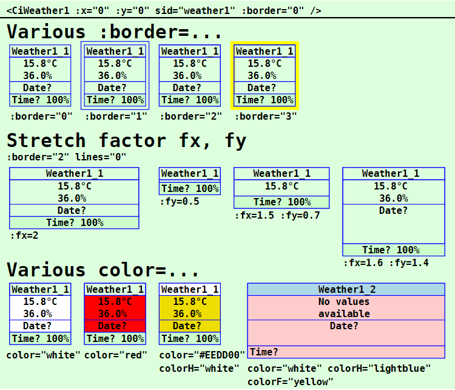
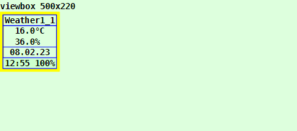
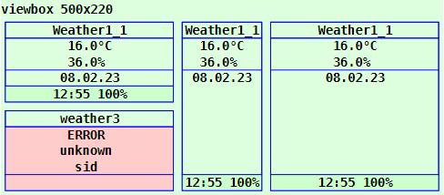

Letzte &Auml;nderung: 9.2.2023 <a name="up"></a>   
<table><tr><td></img></td><td>
<h1>Vue: Verwendung des CiWeather1-Symbols</h1>
<a href="../../LIESMICH.md">==> Startseite</a> &nbsp; &nbsp; &nbsp; 
<a href="./README.md">==> English version</a> &nbsp; &nbsp; &nbsp; 
</td></tr></table><hr>
  
# Ziel
Kennenlernen aller M&ouml;glichkeiten zur Darstellung und Verwendung eines `CiWeather1`-Symbols.   
Allgemein gilt:   
* Das `CiWeather1`-Symbol wartet auf MQTT-Nachrichten und zeigt bestimmte Werte an.   
* Alle Eigenschaften, die die grafische Darstellung des Symbols betreffen, werden im `<template>`-Bereich der Darstellungsdatei (zB in `CiMain.vue`) festgelegt.   
* Alle nicht grafischen Eigenschaften, wie ID, Name, Beschriftungen und MQTT-Funktionalit&auml;t, werden in der Datei `CiWeather1Controller.ts` definiert.   

# Kurzanleitung
* Verzeichnis `vuex170_ci_mqtt_weather1` herunterladen.   
* Visual Studio Code (VSC) starten und den Ordner dieser Vue-Anwendung &ouml;ffnen.   
* In VSC das Terminal &ouml;ffnen und folgendes eingeben:   
`npm run serve`   
* Den Browser (zB Google Chrome) starten und die Seite `localhost:8080` aufrufen.   

Im Browser werden die im _Bild 1_ (siehe unten) dargestellten Symbole angezeigt.   

Will man die MQTT-Funktionalit&auml;t testen, so muss auf einem Rechner (bzw. Raspberry Pi) mit der IP-Adresse `10.1.1.1` ein MQTT-Broker laufen (zB Mosquitto).   
* Entwicklungsrechner mit dem Netzwerk des Broker-Servers verbinden. (Bei WLAN zB SSID `Raspi11`, Passwort `12345678`)   
* Windows-Konsole (`cmd.exe`) starten, ins mosquitto-Verzeichnis wechseln und folgendes eingeben:   
`mosquitto_sub -h 10.1.1.1 -t "#" -v`   
* Das CiWeather1-Symbol wartet auf MQTT-Nachrichten der folgenden Art, die zB von Zigbee-Sensoren gesendet werden oder - zur Simulation - mit dem Programm `mosquitto_pub` in einer Windows-Konsole eingegeben werden k&ouml;nnen:   
`mosquitto_pub -h 10.1.1.1 -t z2m/t/weather/-1 -m "{\"battery\":100,\"humidity\":36,\"temperature\":16.0}"`   
`mosquitto_pub -h 10.1.1.1 -t z2m/t/weather/-1/time -m "20230208 125558"`   
Die Werte werden entsprechend angezeigt.   

Anmerkung: Eine detaillierte Beschreibung zu einzelnen Schritten befindet sich in anderen Kapiteln des Projektes MQTT4HOME.

# Grafische Darstellung eines Ci-Symbols
## Allgemeines
Die Codierung der grafischen Darstellung eines CI-Symbols `CiXxx` erfolgt in einer Datei mit dem Namen wie `CiXxx.vue`. Diese Dateien werden dann von der eigentlichen Projektdatei (zB. `CiMain.vue`) verwendet, um die Web-Seite darzustellen.   
Das folgende Bild zeigt die Ausgabe dieser Vue-Anwendung mit den verschiedenen `CiWeather1`-Darstellungen. Welche Attribute welche Darstellung bewirken, wird anschlie&szlig;end beschrieben.     
   
_Bild 1: Beispiele f&uuml;r verschiedene CiWeather1-Darstellungen_   

## CiWeather1-Aufruf
Das Zeichnen eines CiWeather1-Symbols erfolgt im `<template>`-Bereich der Darstellungsdatei (zB in `CiMain.vue`) durch das Tag `<CiWeather1>` und die Angabe weiterer Attribute.   
_Beispiel_:   
```   
<CiWeather1 :x="50" :y="80" sid="weather1" :border="3" :fx="2" :fy="1.5" color="white"></CiWeather1>
```   

## Positionierung eines Symbols (x, y)
Im Normalfall sind CI-Symbole 100x100 Einheiten gro&szlig; und der Mittelpunkt (50/50) dient zur Positionsangabe (Platzierungspunkt). Ist der Zeichenbereich zB durch   
`<svg width="100%" viewBox="0 0 500 220">`   
definiert, so bewirkt die Ortsangabe `:x="50" :y="70"`, dass das CiWeather1-Symbol an den linken Rand grenzt und 20 Einheiten vom oberen Rand entfernt ist:   
   
_Bild 2: Ort eines CiWeather1-Symbols_   

_Anmerkung_:   
Restlicher Platz unten: 220 - 20 - 100 = 100 Einheiten   
Restlicher Platz rechts: 500 - 100 = 400 Einheiten   

## ID eines Symbols (sid)
Die Symbol-ID (sid) stellt die Verbindung zwischen der grafischen Darstellung und dem Controller dar (siehe Eigenschaft [id](#id) im Kapitel "[Im Basis-Controller definierte Attribute](#id)")

## Rand eines Symbols (border)
Alle CI-Symbole sind im Normalfall au&szlig;en 100x100 Einheiten gro&szlig; und haben nach innen einen fixen Rand von 5 Einheiten. Die individuelle "Arbeitsfl&auml;che" eines Symbols ist also 90 x 90 Einheiten gro&szlig;.   
Durch den Rand ist es m&ouml;glich, Symbole direkt nebeneinander in einem 100er-Raster anzuordnen, ohne dass sich die Symbol-Zeichnungen optisch ber&uuml;hren.   
Will man den Rand eines CI-Symbols darstellen, so gibt es dazu vier M&ouml;glichkeiten, die &uuml;ber das Attribut `:border=` eingestellt werden:   

| Parameter     | Bedeutung                      |   
| ------------- | ------------------------------ |   
| `:border="0"` | Es wird kein Rand dargestellt. |   
| `:border="1"` | Es wird nur der &auml;u&szlig;ere Rand des Symbols dargestellt (= gesamter Platzbedarf des Symbols). |   
| `:border="2"` | Es wird nur der innere Rand des Symbols dargestellt (= der Zeichenbereich f&uuml;r das Symbol). |   
| `:border="3"` | Es wird der Rand des Symbols gelb angezeigt. |   

Vorgabe ist `:border="2"`   

## Textangaben im CiWeather1-Symbol
Jedes `CiWeather1`-Symbol kennt drei m&ouml;gliche Bereiche zur Textausgabe:   
* Kopfzeile   
* Fu&szlig;zeile   
* Zeichenbereich (= Textbereich)   

### Kopfzeile   
Ist im Controller der Parameter `name` definiert, so wird dieser Text angezeigt, ansonsten die `id`.   

### Fu&szlig;zeile
1. Ist im Controller der Parameter `textFooter` definiert, so wird dieser Text angezeigt.   
2. Enth&auml;lt die empfangene MQTT-Nachricht eine Angabe zum Batterieladezustand ("battery") und wird der Wert in der Methode `onMessage()` (Datei `CiWeather12Controller.ts`) dem Attribut zugewiesen, so wird die aktuelle Uhrzeit (HH:MM) und dieser Wert angezeigt.   
3. Ist nur ein Wert f&uuml;r die Uhrzeit vorhanden, so wird dieser angezeigt (HH:MM:SS).   
4. Ist keiner der Punkte 1 bis 3 erf&uuml;llt, wird die `id` angezeigt.   

### Zeichenbereich
Der Zeichenbereich enth&auml;lt drei Zeilen (Zeile 2 bis 4), die folgendes anzeigen:   
#### Zeile 2   
1. Passt die Id des Symbols (`sid`) zu keinem Eintrag in der Liste `public weather1s: Array<Weather1>` (Datei `CiWeather12Controller.ts`), so wird "`ERROR`" angezeigt.   
2. Gibt es einen Temperaturwert, so wird dieser angezeigt.   
3. Ansonsten wird nichts angezeigt (leere Zeile).   
#### Zeile 3   
1. Passt die Id des Symbols (`sid`) zu keinem Eintrag in der Liste `public weather1s: Array<Weather1>` (Datei `CiWeather12Controller.ts`), so wird "`unknown`" angezeigt.   
2. Gibt es einen Feuchtigkeitswert, so wird dieser angezeigt.   
3. Ansonsten wird nichts angezeigt (leere Zeile).   
#### Zeile 4   
1. Passt die Id des Symbols (`sid`) zu keinem Eintrag in der Liste `public weather1s: Array<Weather1>` (Datei `CiWeather12Controller.ts`), so wird "`sid`" angezeigt.   
2. Gibt es einen Luftdruckwert, so wird dieser angezeigt.   
3. Gibt es einen Helligkeitswert, so wird dieser angezeigt.   
4. Ist ein Wert f&uuml;r das Datum vorhanden, so wird dieses angezeigt (DD.MM.YY).   
5. Ansonsten wird nichts angezeigt (leere Zeile).   

## Strecken eines Symbols (fx, fy)
Standardm&auml;&szlig;ig sind alle Symbole 100x100 Einheiten gro&szlig;. Es ist jedoch m&ouml;glich, die Symbole in x- und in y-Richtung zu strecken. Der Platzierungspunkt bleibt dabei gleich.   
Das Strecken erfolgt durch Angabe der Parameter `fx` und `fy`, wie das folgende Bild zeigt:   
   
_Bild 3: Gestrecktes CiWeather1-Symbol_   

Die linken beiden CiWeather1-Symbole sind um den Faktor fx=2 gestreckt (ergibt 2*100 = 200 Einheiten), das dritte Symbol ist um den Faktor fy=2 gesteckt und das rechte Symbol ist um fx=2 und fy=2 gestreckt, d.h., es ist mit einer Gr&ouml;&szlig;e von 200x200 doppelt so gro&szlig; wie das Original.   

__Codierungsbeispiel__:   
```   
<template>
  <svg width="100%" viewBox="0 0 500 220">
  <rect class="ciBackground" x="0" y="0" width="500" height="220" />
  <text x="0" y="15" class="ciFont1">viewbox 500x220</text>
  <CiWeather1 :x="50" :y="70"  sid="weather1" :fx="2" :fy="1"></CiWeather1>
  <CiWeather1 :x="50" :y="170" sid="weather3" :fx="2" :fy="1"></CiWeather1>
  <CiWeather1 :x="250" :y="70" sid="weather1" :fx="1" :fy="2"></CiWeather1>
  <CiWeather1 :x="350" :y="70" sid="weather1" :fx="2" :fy="2"></CiWeather1>
  </svg>
</template>
```   

## Farbe des CiWeather1-Symbols (color, colorH, colorF)
### Farbe des Zeichenbereichs   
Mit Hilfe des Attributs `color=` kann die Hintergrundfarbe des Zeichenbereichs eines CiWeather1-Symbols gesetzt werden. Der Wert kann entweder ein RGB-Wert (rot-gr&uuml;n-blau-Wert), wie zB `#eedd00` oder eine Textangabe wie `red`, `white` etc. sein.   
* Tritt ein Fehler auf, wird die Hintergrundfarbe auf hellrot gesetzt. (Farbe "`colorNotOK`" aus der Datei `Geo.ts`)   
* Ohne Fehler  - und falls ein Farbwert angegeben wurde - wird diese Farbe verwendet.   
* Ansonsten ist der Hintergrund transparent.   

### Farbe der Kopfzeile   
Der Hintergrund der Kopfzeile wird  entweder mit `colorH=` festgelegt oder er ist transparent.   

### Farbe der Fu&szlig;zeile   
* Bei einem Fehler wird die Hintergrundfarbe auf hellrot gesetzt. (Farbe "`colorNotOK`" aus der Datei `Geo.ts`)   
* Ist ein "`battery`"-Wert vorhanden, so wird dieser Wert mit dem `batteryMin`-Wert (=15) verglichen. Ist der "`battery`"-Wert gr&ouml;&szlig;er, wird die Fu&szlig;zeile gr&uuml;n eingef&auml;rbt (`colorOk`) ansonsten hellrot (`colorNotOk`). Tritt ein Fehler auf, wird die Farbe Mittelblau gew&auml;hlt.(`colorUnknown`).   
* Falls ein Farbwert angegeben wurde, wird diese Farbe verwendet.   
* Ansonsten ist der Hintergrund transparent.   

<a name="id"></a>   
# Nicht-grafische Eigenschaften
## Im Basis-Controller definierte Attribute
Eigenschaften von CI-Symbolen, die nichts mit der grafischen Darstellung des Symbols zu tun haben, werden in "`xxxController.ts`"-Dateien definiert.   
Folgende Attribute sind im Basis-Controller (Datei `CiBaseController.ts`) definiert und m&uuml;ssen in allen abgeleiteten Controllern zwingend angegeben werden:   
| Eigenschaft  | Bedeutung                                |   
| ------------ | ---------------------------------------- |   
| `id`         | Sollte im Normalfall eine eindeutige Bezeichnung eines CiWeather1-Symbols sein.    |   
| `subTopic`   | Nachrichten bzw. MQTT-Topics, auf die das CiWeather1-Symbol "h&ouml;rt" (kann auch leer '' sein). |   
| `pubTopic`   | MQTT-Topics, die das CiWeather1-Symbol beim Klicken sendet. |   

Folgende Attribute sind optional:   
| Eigenschaft  | Bedeutung                            |   
| ------------ | ------------------------------------ |   
| `name`       | Name eines CiWeather1-Symbols. Kann in der Kopfzeile des Symbols angezeigt werden. |   
| `pubPayload` | Payload, die beim Senden einer Nachricht verwendet werden soll. |   


## In `CiWeather1Controller.ts` definierte Eigenschaften
Folgende Attribute sind zwingend anzugeben:   
| Eigenschaft         | Bedeutung                            |   
| ------------------- | ------------------------------------ |   
| `iWeather1State`    | Status des CiWeather1-Symbols. Daf&uuml;r sind die Konstanten `stateOk`, `stateNotOk` und `stateNoState` in `CiWeather1Controller.ts` definiert.   |   
| `type`              | Typ des Weather1 Symbols. Sagt etwas dar&uuml;ber aus, welche Daten erwartet werden, zB `json_THB`: Es wird ein json-String erwartet, der die Schl&uuml;ssel `temperature`, `humidity` und `battery` enth&auml;lt.   |   
| `lastWeather1Date` | Datum, wann die letzte Wetter-Nachricht eingetroffen ist.<br>Kann beim Ausf&uuml;llen f&uuml;r ein bestimmtes Symbol zB auf `Date?` oder `--.--.--` gesetzt werden.   |   
| `lastWeather1Time` | Uhrzeit, wann die letzte Wetter-Nachricht eingetroffen ist.<br>Kann beim Ausf&uuml;llen f&uuml;r ein bestimmtes Symbol zB auf `Time?` oder `--:--` gesetzt werden.   |   

Folgende Attribute sind optional und k&ouml;nnen bei Bedarf verwendet werden:   
| Eigenschaft    | Bedeutung                            |   
| -------------- | ------------------------------------ |   
| `temperature`  | String mit dem Temperaturwert oder beliebigem anderen Text f&uuml;r die Zeile 2 des Symbols.   |   
| `humidity`     | String mit dem Feuchtigkeitswert oder beliebigem anderen Text f&uuml;r die Zeile 3 des Symbols.   |   
| `pressure`     | String mit dem Luftdruckwert oder beliebigem anderen Text f&uuml;r die Zeile 4 des Symbols.   |   
| `brightness`   | String mit dem Helligkeitswert oder beliebigem anderen Text f&uuml;r die Zeile 4 des Symbols.   |   
| `battery`      | String mit dem Ladezustand einer Batterie. Wird in Zeile 5 angezeigt.   |   
| `textFooter`   | Angabe eines fixen Textes in der Fu&szlig;zeile. |   

## Beispiel: Codierung des `CiWeather1Controller.ts`   
Im Normalfall m&uuml;ssen nur die Werte innerhalb des Bereichs `Array<CiWeather1>` erg&auml;nzt werden.   
Im unten stehenden Beispiel sind zwei CiWeather1-Symbole definiert, wobei das zweite Symbol 
einen eventuellen `battery`-Wert nicht auswertet. Das Symbol dient nur dazu, die Farbe der Fu&szlig;zeile zu zeigen (falls Messwerte vorhanden sind).   
In der Methode `public onMessage (message: Message): void` werden die Strings f&uuml;r "`temperature`", "`humidity`" und "`brightness`" (oder "`pressure`") dazu genutzt, im Fehlerfall den Text "`ERROR in JSON payload`" anzuzeigen.   

M&ouml;chte man zus&auml;tzliche MQTT-Funktionalit&auml;ten beim Empfang von Nachrichten implementieren, so kann der Code in der Methode `public onMessage (message: Message): void` entsprechend erg&auml;nzt werden.   

```
// ______CiWeather1Controller.ts_________________khartinger_____
// 2022-01-01: new
// 2023-02-09: change at CiBase (add Geo.ts)
import { reactive } from 'vue'
import { Message } from '@/services/CiMqttClient'
import { CiBaseController, IBase } from './CiBaseController'
import { geo0f } from '../classes/Geo'

export interface Weather1 extends IBase {
  // ---------mandatory-----------------------------------------
  iWeather1State: number;
  type: string;
  lastWeather1Date: string;
  lastWeather1Time: string;
  // ---------optional------------------------------------------
  temperature?: string;
  humidity?: string;
  pressure?: string;
  brightness?: string;
  battery?: string;
  textFooter?: string;
}

export class CiWeather1Controller extends CiBaseController {
  public weather1s: Array<Weather1> = reactive(
    [
      { // ---weather1------------------------------------------
        id: 'weather1',
        name: 'Weather1_1',
        type: 'json_THB', // json-keys: temperature, humidity, battery
        iWeather1State: -99,
        lastWeather1Date: 'Date?',
        lastWeather1Time: 'Time?',
        subTopic: 'z2m/t/weather/-1 z2m/t/weather/-1/time',
        pubTopic: ''
      },
      { // ---weather2: no battery------------------------------
        id: 'weather2',
        name: 'Weather1_2',
        type: 'json_TH', // json-keys: temperature, humidity
        temperature: 'No values',
        humidity: 'available',
        iWeather1State: -99,
        lastWeather1Date: 'Date?',
        lastWeather1Time: 'Time?',
        subTopic: 'z2m/t/weather/-2 z2m/t/weather/-2/time',
        pubTopic: ''
      }
    ]
  );

  // --------------state constants------------------------------
  public stateOk = -1;
  public stateNotOk = -998;
  public stateNoState = -999;

  // --------------Message for this ci (control/indicator)?-----
  public onMessage (message: Message): void {
    this.weather1s.forEach(weather1 => {
      const aSubTopic = weather1.subTopic.split(' ')
      if (aSubTopic.includes(message.topic)) {
        // --------weather1 topic found ------------------------
        console.log('onMessage:', message.topic)
        if (message.topic.includes('time')) {
          // ------brokertime yyyymmdd HHMMSS received?---------
          if (message.payload.length === 15) {
            weather1.lastWeather1Date = message.payload.substring(6, 8) + '.' + message.payload.substring(4, 6) + '.' + message.payload.substring(2, 4)
            weather1.lastWeather1Time = message.payload.substring(9, 11) + ':' + message.payload.substring(11, 13) + ':' + message.payload.substring(13, 15)
          } else {
            weather1.lastWeather1Date = geo0f.noDate
            weather1.lastWeather1Time = geo0f.noTime
          }
          // ------END brokertime yyyymmdd HHMMSS received?-----
        } else {
          // ------work on different weather types--------------
          weather1.iWeather1State = this.stateNotOk
          if (weather1.type === 'json_THB') {
            try {
              const aPayload = JSON.parse(message.payload)
              weather1.temperature = aPayload.temperature.toFixed(1) + '°C'
              weather1.humidity = aPayload.humidity.toFixed(1) + '%'
              weather1.battery = aPayload.battery + '%'
              // weather1.brightness = aPayload.brightness.toFixed(0) + ' lx'
              weather1.iWeather1State = this.stateOk
            } catch (error) {
              weather1.temperature = 'ERROR' //  = line 2
              weather1.humidity = 'in JSON' //   = line 3
              weather1.brightness = 'payload' // = line 4
              console.log('onMessage error=', error)
            }
          }
          if (weather1.type === 'json_TH') {
            try {
              const aPayload = JSON.parse(message.payload)
              weather1.temperature = aPayload.temperature.toFixed(1) + '°C'
              weather1.humidity = aPayload.humidity.toFixed(1) + '%'
              // weather1.battery = aPayload.battery + '%'
              weather1.iWeather1State = this.stateOk
            } catch (error) {
              weather1.temperature = 'ERROR' //  = line 2
              weather1.humidity = 'in JSON' //   = line 3
              weather1.pressure = 'payload' // = line 4
              console.log('onMessage error=', error)
            }
          }
          if (weather1.type === 'something_else') {
            try {
              // ...add functionality for another sensor here...
            } catch (error) { }
          }
        } // ------END work on different weather types----------
      } // --------END weather1 topic found---------------------
    })
  }

  public publishCi (topic: string, payload: string): void {
    // console.log('publish:', '-t ' + topic + ' -m ' + payload)
    this.publish(topic, payload, false, 0).catch((e) => { console.error('CiWeatherController: ERROR:', e) })
  }
}

export const ciWeather1Controller = new CiWeather1Controller()
```

[Zum Seitenanfang](#up)
