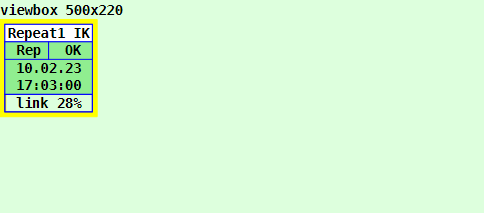

Last modified: 2023-02-10 <a name="up"></a>   
<table><tr><td></td><td>
<h1>Vue: Using the CiRepeater1 symbol</h1>
<a href="../../README.md">==> Home page</a> &nbsp; &nbsp; &nbsp; 
<a href="./LIESMICH.md">==> German version</a> &nbsp; &nbsp; &nbsp; 
</td></tr></table><hr>

# Target
Getting to know all the ways to display and use a `CiRepeater1` symbol.   
In general:   
* The `CiRepeater1` icon waits for and displays MQTT messages from repeaters.   
* All properties concerning the graphical representation of the symbol are set in the `<template>` area of the representation file (e.g. in `CiMain.vue`).   
* All non-graphical properties, such as ID, name, labels and MQTT functionality, are defined in the `CiRepeater1Controller.ts` file.   

# Quick Reference
* Download directory `vue150_ci_mqtt_CiRepeater1`.   
* Start Visual Studio Code (VSC) and open the folder of this Vue application.   
* In VSC open the terminal and type the following:   
`npm run serve`   
* Start the browser (e.g. Google Chrome) and call the page `localhost:8080`.   

In the browser the symbols shown in _Fig. 1_ (see below) are displayed.   

If you want to test the MQTT functionality, you have to run an MQTT broker (e.g. Mosquitto) on a computer (or Raspberry Pi) with the IP address `10.1.1.1`.   
* Connect the development computer to the network of the broker server. (For WLAN e.g. SSID `Raspi11`, password `12345678`)   
* Start Windows console (`cmd.exe`), change to the mosquitto directory and enter the following:   
`mosquitto_sub -h 10.1.1.1 -t "#" -v`   
* The CiRepeater1 symbol waits for MQTT messages of the following type, which are e.g. sent by Zigbee sensors or - for simulation - can be entered with the program `mosquitto_pub` in a Windows console:   
  * `mosquitto_pub -h 10.1.1.1 -t z2m/t/repeater/-1 -m "{\"last_seen\":\"2023-02-10T17:03:00+02:00\",\"linkquality\":72,\"update\":{\"state\":\"idle\"},\"update_available\":false}"`   
  * `mosquitto_pub -h 10.1.1.1 -t z2m/t/repeater/-1/time -m "20230209 123344"`   
The values are displayed accordingly.   

Note: A detailed description of individual steps can be found in other chapters of the MQTT4HOME project.

## Graphic representation of a ci symbol
## General
The coding of the graphical representation of a CI symbol `CiXxx` is done in a file with a name like `CiXxx.vue`. These files are then used by the actual project file (e.g. `CiMain.vue`) to display the web page.   
The following image shows the output of this Vue application with the different `CiRepeater1` representations. Which attributes cause which representation is described afterwards.     
   
_Fig. 1: Examples for different CiRepeater1 representations_.   

## CiRepeater1 call
The drawing of a CiRepeater1 symbol is done in the `<template>` area of the presentation file (e.g. in `CiMain.vue`) by the tag `<CiRepeater1>` and further attributes.   
_Example_:   
```   
<CiRepeater1 :x="50" :y="80" sid="repeater1" :border="3" :fx="2" :fy="1.5" colorH="white"></CiRepeater1>
```   

## Positioning of a symbol (x, y)
Normally CI symbols are 100x100 units in size and the center point (50/50) is used to indicate the position (placement point). If the drawing area is defined e.g. by   
`<svg width="100%" viewBox="0 0 500 220">`   
then the location specification `:x="50" :y="70"` causes the CiRepeater1 to border the left edge and be 20 units away from the top edge:   
   
_Fig. 2: Location of a CiRepeater1 symbol_   

_Note_:   
Remaining space at the bottom: 220 - 20 - 100 = 100 units.   
Remaining space right: 500 - 100 = 400 units   

## ID of a symbol (sid)
The symbol ID (sid) represents the connection of the graphical representation to the controller (see property [id](#id) in chapter "[Attributes defined in the base controller](#id)").

## Border of a symbol (border)
All CI symbols are normally 100x100 units on the outside and have a fixed margin of 5 units on the inside. So the individual "workspace" of a symbol is 90x90 units.   
The margin makes it possible to arrange symbols directly next to each other in a 100-unit grid without the symbol drawings visually touching each other.   
If you want to display the border of a CI symbol, there are four possibilities for this, which are set via the attribute `:border=`:   

| Parameter | Meaning |   
| ------------- | ------------------------------ |   
| `:border="0"` | No border will be displayed. |   
| `:border="1"` | Only the outer border of the symbol is displayed (= total space required by the symbol). |   
| `:border="2"` | Only the inner border of the symbol is shown (= the drawing area for the symbol). |   
| `:border="3"` | The border of the symbol is displayed in yellow. |   

Default is `:border="2"`.   

## Text information in CiRepeater1 symbol
Each `CiRepeater1` symbol knows three possible areas for text output:   
* header   
* footer   
* drawing area (= text area)   

### Header
If the parameter `name` is defined in the controller, this text is displayed, otherwise the `id`.

### Footer
1. if the `textFooter` parameter is defined in the controller, this text is displayed.   
2. If the received MQTT message contains an indication of the link quality and if the value is assigned to the attribute in the `onMessage()` method (file `CiRepeater12Controller.ts`), then this value is displayed.   
3. If none of the points 1 and 2 is fulfilled, nothing is displayed (empty line).   

### Character area
The character area contains three lines (lines 2 to 4) that indicate the following:   
#### Line 2   
On the left side the text "`Rep`" (for repeater) and on the right side the state is displayed (`ok`, `OK` or `?`)   
#### Line 3   
1. if the id of the symbol (`sid`) does not match any entry in the list `public repeater1s: Array<Repeater1>` (file `CiRepeater12Controller.ts`), "`unknown`" is displayed.   
2. if there is a date value, it will be displayed (format `dd.mm.yy`).   
3. otherwise `date?` is displayed.   
#### Line 4   
1. if the id of the symbol (`sid`) does not match any entry in the list `public repeater1s: Array<Repeater1>` (file `CiRepeater12Controller.ts`), "`sid`" is displayed.   
2. if there is a time value, it will be displayed (format `HH:MM:SS`).   
3. Otherwise `Time?` is displayed.   

## Stretching of a symbol (fx, fy)
By default, all symbols are 100x100 units in size. However, it is possible to stretch the symbols in x and in y direction. The placement point remains the same.   
Stretching is done by specifying the parameters `fx` and `fy`, as the following example shows:   
   
_Fig. 3: Stretched CiRepeater1 symbol_   

The left two CiRepeater1 symbols are stretched by the factor fx=2 (results in 2*100 = 200 units), the third symbol is stretched by the factor fy=2 and the right symbol is stretched by fx=2 and fy=2, i.e. it is twice as large as the original with a size of 200x200.   

__Coding example__:   
```   
<template>
  <svg width="100%" viewBox="0 0 500 220">
    <rect class="ciBackground" x="0" y="0" width="500" height="220" />
  <text x="0" y="15" class="ciFont1">viewbox 500x220</text>
  <CiRepeater1 :x="50" :y="70"  sid="repeater1" :fx="2" :fy="1"></CiRepeater1>
  <CiRepeater1 :x="50" :y="170" sid="repeaterX" :fx="2" :fy="1"></CiRepeater1>
  <CiRepeater1 :x="250" :y="70" sid="repeater1" :fx="1" :fy="2"></CiRepeater1>
  <CiRepeater1 :x="350" :y="70" sid="repeater1" :fx="2" :fy="2"></CiRepeater1>
  </svg>
</template>
```   

## Color of the CiRepeater1 symbol (colorH, colorF)
### Color of the drawing area
The background color of the drawing area is set automatically:   
* If an error occurs, the background color is set to light red. (color "`colorNotOK`" from the file `Geo.ts`).   
* If the repeater state is ok, the background is set to light green (`colorRepeater`).   
* In all other cases the background is set light gray (`colorNoRepeater`).   

### Header color   
With the help of the attribute `colorH=` the background color of the header of a CiRepeater1 symbol can be set. The value can either be an RGB value (red-green-blue value), such as `#eedd00` or a text specification such as `red`, `white` etc..   
If no color is selected, the header is transparent.   

### Footer color   
* In case of an error the background color is set to light red. (Color "`colorNotOK`" from the file `Geo.ts`).   
* If the repeater state is ok, the background is set to light green (`colorRepeater`).   
* If a color value was specified with `colorF=`, this color will be used.   
* In all other cases the background is set transparent (`none`).

<a name="id"></a>   
# Non-graphical attributes
## Attributes defined in the base controller.
Attributes of CI symbols that have nothing to do with the graphical representation of the symbol are defined in "`xxxController.ts`" files.   
The following attributes are defined in the base controller (`CiBaseController.ts` file) and must be mandatory in all derived controllers:   
| Property     | Meaning                                  |   
| ------------ | ---------------------------------------- |   
| `id`         | Should normally be a unique name of a CiRepeater1 symbol.    |   
| `subTopic`   | Messages or MQTT topics the CiRepeater1 symbol "listens" to (can also be empty ''). |   
| `pubTopic`   | MQTT topics that the CiRepeater1 symbol sends when clicked. |   

The following attributes are optional:   
| property     | meaning                              |   
| ------------ | ------------------------------------ |   
| `name`       | Name of a CiRepeater1 symbol. Can be displayed in the header of the icon. |   
| `pubPayload` | Payload to be used when sending a message. |   


## Attributes defined in `CiRepeater1Controller.ts`.
The following attributes are mandatory:
| property     | meaning                              |   
| ------------ | ------------------------------------ |   
| `iRepeater1State` | State of the CiRepeater1 symbol. For this purpose the constants `stateOn`, `stateOk`, `stateLastSeen` and `stateNoState` are defined in the file `CiRepeater1Controller.ts`.   |   
| `type` | Type of the CiRepeater1 symbol. Tells something about what data is expected from the repeater.   |   
| `lastRepeater1Date` | Date when the last repeater message arrived.<br>Can be set to `Date?` or `--.--.--` when filling for a specific symbol, for example.   |   
| `lastRepeater1Time` | Time when the last repeater message arrived.<br>Can be set to `Time?` or `--:--` when filling in for a specific symbol, for example.   |   

The following attributes are optional and can be used if required:   
| property       | meaning                              |   
| -------------- | ------------------------------------ |   
| `linkquality` | Specification of the link quality (for IKEA e.g. a value from 0 to 255). Displayed in line 5.   |   
| `textFooter`   | Specification of a fixed text in the footer line. |   

## Example: Coding of the `CiRepeater1Controller.ts`.   
Normally, only the values within the `Array<CiRepeater1>` area need to be added.   
In the example below one CiRepeater1 symbol is defined.   
In the method `public onMessage (message: Message): void` the strings for "`lastRepeater1Date`" and "`lastRepeater1Time`" are used to display the text "`ERROR json`" in case of an error.   

If one wants to implement additional MQTT functionality when receiving messages, the code in the `public onMessage (message: Message): void` method can be supplemented accordingly.   

```
// ______CiRepeater1Controller.ts________________khartinger_____
// 2022-10-19: new
// 2023-02-10: change at CiBase (add Geo.ts)
import { reactive } from 'vue'
import { Message } from '@/services/CiMqttClient'
import { CiBaseController, IBase } from './CiBaseController'
import { geo0f } from '../classes/Geo'

export interface Repeater1 extends IBase {
  // ---------mandatory-----------------------------------------
  iRepeater1State: number;
  type: string;
  lastRepeater1Date: string;
  lastRepeater1Time: string;
  // ---------optional------------------------------------------
  linkquality?: string;
  textFooter?: string;
}

export class CiRepeater1Controller extends CiBaseController {
  public repeater1s: Array<Repeater1> = reactive(
    [
      { // ---repeater1: IKEA-------------------------------------
        id: 'repeater1',
        name: 'Repeat1 IKEA',
        type: 'TRADFRI', // IKEA
        iRepeater1State: -99,
        lastRepeater1Date: 'Date?',
        lastRepeater1Time: 'Time?',
        subTopic: 'z2m/t/repeater/-1 z2m/t/repeater/-1/time',
        pubTopic: ''
      }
    ]
  );

  // --------------state constants------------------------------
  public stateOk = -1;
  public stateLastSeen = -2;
  public stateNotOk = -998;
  public stateNoState = -999;

  // --------------Message for this ci (control/indicator)?-----
  public onMessage (message: Message): void {
    this.repeater1s.forEach(repeater1 => {
      const aSubTopic = repeater1.subTopic.split(' ')
      if (aSubTopic.includes(message.topic)) {
        // --------repeater1 topic found ------------------------
        console.log('onMessage:', message.topic, ', payload', message.payload)
        if (message.topic.includes('time')) {
          // ------brokertime yyyymmdd HHMMSS received?---------
          if (message.payload.length === 15) {
            repeater1.lastRepeater1Date = message.payload.substring(6, 8) + '.' + message.payload.substring(4, 6) + '.' + message.payload.substring(2, 4)
            repeater1.lastRepeater1Time = message.payload.substring(9, 11) + ':' + message.payload.substring(11, 13) + ':' + message.payload.substring(13, 15)
            repeater1.iRepeater1State = this.stateOk
          } else {
            repeater1.lastRepeater1Date = geo0f.noDate
            repeater1.lastRepeater1Time = geo0f.noTime
          }
          // ------END brokertime yyyymmdd HHMMSS received?-----
        } else {
          // ------work on different repeater types-------------
          repeater1.iRepeater1State = this.stateNotOk
          repeater1.lastRepeater1Date = geo0f.noDate
          repeater1.lastRepeater1Time = geo0f.noTime
          if (repeater1.type === 'TRADFRI') {
            try {
              const aPayload = JSON.parse(message.payload)
              // {"last_seen":"2022-10-19T17:03:00+02:00","linkquality":72,"update":{"state":"idle"},"update_available":false}
              if (aPayload.last_seen.length > 24) {
                const dt = aPayload.last_seen // "last_seen":"2022-10-19T17:03:00+02:00"
                const date1 = dt.substring(8, 10) + '.' + dt.substring(5, 7) + '.' + dt.substring(2, 4)
                repeater1.lastRepeater1Date = date1
                repeater1.lastRepeater1Time = dt.substring(11, 19)
                const lqiPercent = Math.round(aPayload.linkquality * 100 / 255)
                repeater1.linkquality = ' link ' + `${lqiPercent}` + '% = ' + `${aPayload.linkquality}` + ' lqi'
                repeater1.iRepeater1State = this.stateLastSeen
                // console.log('Repeater:', aPayload.last_seen + ' = ' + date1 + ' ' + dt.substring(11, 19) + ' state=' + repeater1.iRepeater1State)
              }
            } catch (error) {
              repeater1.lastRepeater1Date = 'ERROR'
              repeater1.lastRepeater1Time = 'json'
              console.log('onMessage error=', error)
            }
          }
          if (repeater1.type === 'something_else') {
            try {
              // ...add functionality for another sensor here...
            } catch (error) { }
          }
        } // ------END work on different repeater types----------
      } // --------END repeater1 topic found---------------------
    })
  }

  public publishCi (topic: string, payload: string): void {
    // console.log('publish:', '-t ' + topic + ' -m ' + payload)
    this.publish(topic, payload, false, 0).catch((e) => { console.error('CiRepeaterController: ERROR:', e) })
  }
}

export const ciRepeater1Controller = new CiRepeater1Controller()
```

[Top of page](#up)
