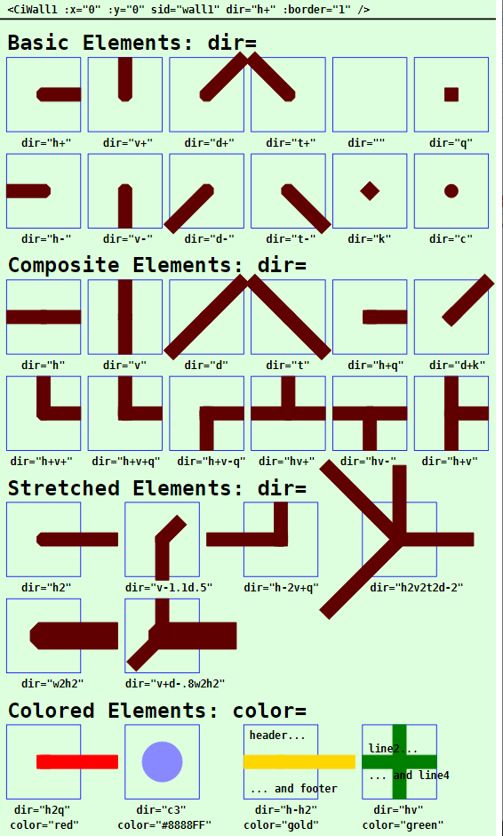

Letzte &Auml;nderung: 12.2.2023 <a name="up"></a>   
<table><tr><td></img></td><td>
<h1>Vue: Verwendung des CiWall1-Symbols</h1>
<a href="../../LIESMICH.md">==> Startseite</a> &nbsp; &nbsp; &nbsp; 
<a href="./README.md">==> English version</a> &nbsp; &nbsp; &nbsp; 
</td></tr></table><hr>
  
# Ziel
Kennenlernen aller M&ouml;glichkeiten zur Darstellung und Verwendung eines `CiWall1`-Symbols.   
Allgemein gilt:   
* Das `CiWall1`-Symbol dient zum Zeichnen von Grundrissen und hat selbst keine MQTT-Funktion.   
* Alle Eigenschaften, die die grafische Darstellung des Symbols betreffen, werden im `<template>`-Bereich der Darstellungsdatei (zB in `CiMain.vue`) festgelegt.   

# Kurzanleitung
* Verzeichnis `vuex310_ci_mqtt_wall1` herunterladen.   
* Visual Studio Code (VSC) starten und den Ordner dieser Vue-Anwendung &ouml;ffnen.   
* In VSC das Terminal &ouml;ffnen und folgendes eingeben:   
`npm run serve`   
* Den Browser (zB Google Chrome) starten und die Seite `localhost:8080` aufrufen.   

Im Browser werden die im _Bild 1_ (siehe unten) dargestellten Symbole angezeigt.   

Anmerkung: Eine detaillierte Beschreibung zu einzelnen Schritten befindet sich in anderen Kapiteln des Projektes MQTT4HOME.

# Grafische Darstellung eines Ci-Symbols
## Allgemeines
Die Codierung der grafischen Darstellung eines CI-Symbols `CiXxx` erfolgt in einer Datei mit dem Namen wie `CiXxx.vue`. Diese Dateien werden dann von der eigentlichen Projektdatei (zB. `CiMain.vue`) verwendet, um die Web-Seite darzustellen.   
Das folgende Bild zeigt die Ausgabe dieser Vue-Anwendung mit den verschiedenen `CiWall1`-Darstellungen. Welche Attribute welche Darstellung bewirken, wird anschlie&szlig;end beschrieben.     
   
_Bild 1: Beispiele f&uuml;r verschiedene CiWall1-Darstellungen_   

## CiWall1-Aufruf
Das Zeichnen eines CiWall1-Symbols erfolgt im `<template>`-Bereich der Darstellungsdatei (zB in `CiMain.vue`) durch das Tag `<CiWall1>` und die Angabe weiterer Attribute.   
_Beispiel_:   
```   
<CiWall1 :x="50" :y="70" sid="wall1" dir="h+v+q" :border="3" color="red"></CiWall1>
```   

## Positionierung eines Symbols (x, y)
Im Normalfall sind CI-Symbole 100x100 Einheiten gro&szlig; und der Mittelpunkt (50/50) dient zur Positionsangabe (Platzierungspunkt). Ist der Zeichenbereich zB durch   
`<svg width="100%" viewBox="0 0 500 220">`   
definiert, so bewirkt die Ortsangabe `:x="50" :y="70"`, dass das CiWall1-Symbol an den linken Rand grenzt und 20 Einheiten vom oberen Rand entfernt ist:   
   
_Bild 2: Ort eines CiWall1-Symbols_   

_Anmerkung_:   
Restlicher Platz unten: 220 - 20 - 100 = 100 Einheiten   
Restlicher Platz rechts: 500 - 100 = 400 Einheiten   

## ID eines Symbols (sid)
Die ID ist normalerweise die eindeutige Bezeichnung eines Ci-Symbols und stellt die Verbindung zum Controller dar. F&uuml;r `CiWall1`-Symbole ist die Angabe belanglos.   

## Rand eines Symbols (border)
Normalerweise sind CI-Symbole au&szlig;en 100x100 Einheiten gro&szlig; und haben nach innen einen fixen Rand von 5 Einheiten. Beim CiWall1-Symbol ist dies anders:   
Damit nebeneinander liegende Symbole in einem 100er Raster eine kontinuerliche Darstellung bewirken, gehen die `CiWall1`-Symbole bis an die Symbolgrenze, sind also ausnahmsweise 100x100 Einheiten gro&szlig;.   
Im Normalfall wird der Rand der `CiWall1`-Symbole nicht dargestellt. Will man den Rand ausnahmsweise darstellen, so gibt es dazu vier M&ouml;glichkeiten, die &uuml;ber das Attribut `:border=` eingestellt werden:   

| Parameter     | Bedeutung                      |   
| ------------- | ------------------------------ |   
| `:border="0"` | Es wird kein Rand dargestellt. |   
| `:border="1"` | Es wird nur der &auml;u&szlig;ere Rand des Symbols dargestellt (= gesamter Platzbedarf des Symbols). |   
| `:border="2"` | Es wird nur der innere Rand des Symbols dargestellt (= der Zeichenbereich f&uuml;r das Symbol). |   
| `:border="3"` | Es wird der Rand des Symbols gelb angezeigt. |   

Vorgabe ist `:border="0"`   
_Beachte_: Auch wenn das Symbol gestreckt wird, wird immer nur der Rand des 100x100 gro&szlig;en "Basis"-Symbols dargestellt.   

## Wandelemente (dir)
### Basiselemente
Zur Darstellung von W&auml;nden stehen 12 Basiselemente zur Verf&uuml;gung, die im Zentrum des Symbols starten:   
* Vier Elemente in Richtung der Koordinatenachsen nach rechts (`h+`), links (`h-`), oben (`v+`) und unten (`v-`).   
* Vier Elemente in Richtung der Diagonalen rechts-oben (`d+`), links-oben (`t+`), links-unten (`-d`) und rechts-unten (`t-`).   
* Vier Sonderelemente: leeres Symbol, Quadrat (`q`), Karo (`k`) und Kreis (`c`).   

Die ersten acht Elemente sind im Zentrum abgeschr&auml;gt, damit bei Kombinationen von geraden und schr&auml;gen Elementen keine Ecken heraustehen:   
   
_Bild 3: Basis-Wandelemente_   

Zus&auml;tzlich kann in einem Symbol noch die Wandbreite (Vorgabe = Zeilenh&ouml;he) mit dem Attribut `w` vergr&ouml;&szlig;ert und verkleinert werden. Die Ver&auml;nderung gilt f&uuml;r alle Elemente NACH der w-Angabe.   

Die Angabe der Richtung(en) erfolgt im `dir=` Attribut.   

### Kombinierte Elemente
Um Ecken etc. darzustellen, werden die Basiselemente miteinander kombiniert.   

| _Beispiele:_   |         |   
| -------------- | ------- |   
| `dir="h+v+"`   | Ecke nach rechts und oben (mit schr&auml;ger &auml;u&szlig;erer Ecke).   |   
| `dir="h+v+q"`  | Ecke nach rechts und oben (mit rechtwinkliger &auml;u&szlig;erer Ecke).   |   
| `dir="h"`      | Waagrechte (horizontale) Wand (entspricht `h+h-`).   |   
| `dir="v"`      | Senkrechte (vertikale) Wand (entspricht `v+v-`).   |   
| `dir="hv"`     | Gekreuzte Wand (wie ein +).   |   
| `dir="h+v"`    | Senkrechte Wand mit Abzweigung nach rechts (wie `\|-`).      
| `dir="d+t+k"`  | Ecke von links-oben zum Zentrum und nach rechts-oben (wie ein V).   |   

## Strecken eines Symbols
Durch Angabe einer Zahl nach dem Richtungsbuchstaben kann das Wandelement gestreckt oder verk&uuml;rzt werden. Als Basisl&auml;nge ("1") dient die HALBE Gr&ouml;&szlig;e des Symbols (100/2 = 50 Einheiten).   
_Beispiele:_   
* `dir="h-h3"` ergibt eine waagrechte Wand, die genau zwei Symbole lang ist (links oben).   
* `dir="w3h-h3"` ergibt eine waagrechte Wand mit dreifacher Wandst&auml;rke (durch "w3"), die genau zwei Symbole lang ist (links unten).   
* `dir="c3"` ergibt einen Kreis (zB eine "S&auml;ule" im Hausgrundriss) mit dreifachem Durchmesser (rechts oben).   
   
_Bild 4: Gestreckte CiWall1-Symbole_   

__Codierungsbeispiel__:   
```   
<template>
  <svg width="100%" viewBox="0 0 500 220">
  <rect class="ciBackground" x="0" y="0" width="500" height="220" />
  <text x="0" y="15" class="ciFont1">viewbox 500x220</text>
  <CiWall1 :x="50" :y="70" sid="wall1" dir="h-h3" :border="1"></CiWall1>
  <CiWall1 :x="50" :y="170" sid="wall1" dir="w3h-h3" :border="1"></CiWall1>
  <CiWall1 :x="300" :y="70" sid="wall1" dir="c3" :border="1"></CiWall1>
  <CiWall1 :x="300" :y="170" sid="wall1" dir="h-1.5d2t-.5" :border="1"></CiWall1>
  </svg>
</template>
```   

## Farbe des CiWall1-Symbols (color)   
Die Vorgabe f&uuml;r die Wandfarbe ist dunkelrot (`colorWall = '#600000'`, definert in der Datei `Geo.ts`).   
Mit dem Attribut "`color=`" kann die Farbe der Wand ge&auml;ndert werden. Der Wert kann entweder ein RGB-Wert (rot-gr&uuml;n-blau-Wert), wie zB `#ffee00` oder eine Textangabe wie `red`, `green` etc. sein.   

## Textangaben im CiWall1-Symbol
Normalerweise wird mit dem `CiWall1`-Symbol kein Text ausgegeben, trotzdem gibt es vier M&ouml;glichkeiten, dies zu tun:   
* Kopfzeile   
* Fu&szlig;zeile   
* Zeile 2 unmittelbar &uuml;ber der Wand   
* Zeile 4 unmittelbar unter der Wand      

Die Angabe des Textes erfolgt direkt im Tag mit den Attributen `header=""`, `footer=""`, `line2=""` und `line4=""`.   

[Zum Seitenanfang](#up)
