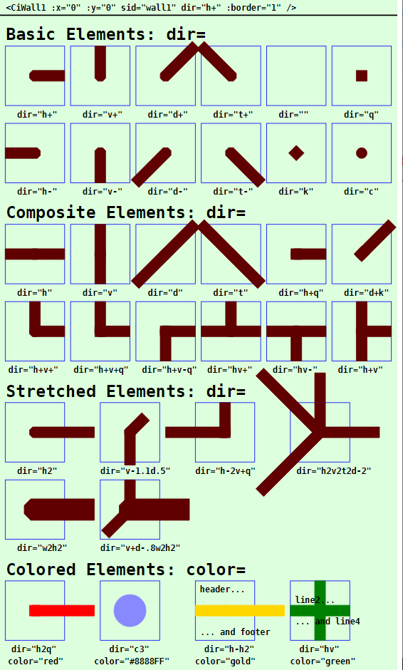
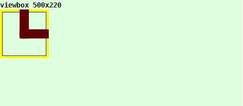
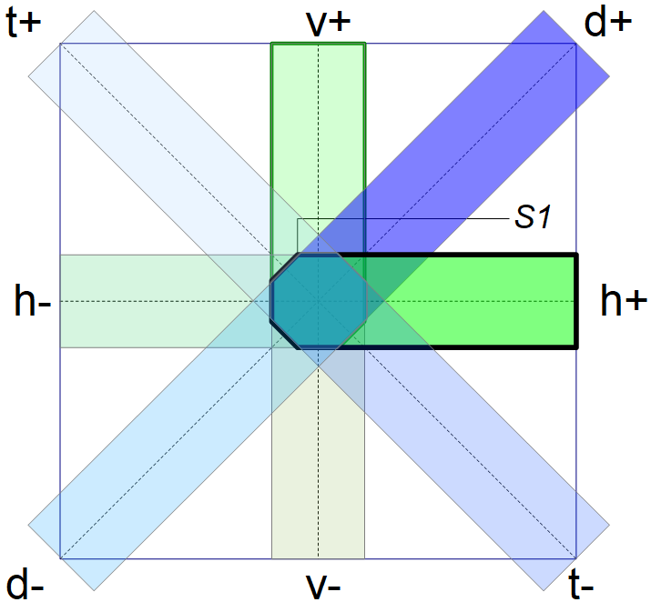
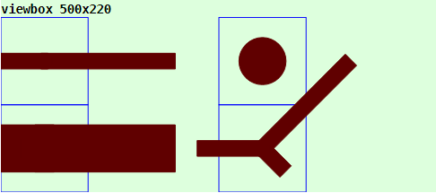

Last modified: 2023-02-12 <a name="up"></a>   
<table><tr><td></td><td>
<h1>Vue: Using the CiWall1 symbol</h1>
<a href="../../README.md">==> Home page</a> &nbsp; &nbsp; &nbsp; 
<a href="./LIESMICH.md">==> German version</a> &nbsp; &nbsp; &nbsp; 
</td></tr></table><hr>

# Target
Getting to know all the ways to display and use a `CiWall1` symbol.   
In general:   
* The `CiWall1` symbol is used to draw floor plans and has no MQTT function itself.
* All properties concerning the graphical representation of the symbol are set in the `<template>` area of the representation file (e.g. in `CiMain.vue`).   

# Quick Reference
* Download directory `vuex310_ci_mqtt_wall1`.   
* Start Visual Studio Code (VSC) and open the folder of this Vue application.   
* In VSC open the terminal and type the following:   
`npm run serve`   
* Start the browser (e.g. Google Chrome) and call the page `localhost:8080`.   

In the browser the symbols shown in _Fig. 1_ (see below) are displayed.   

Note: A detailed description of individual steps can be found in other chapters of the MQTT4HOME project.

## Graphic representation of a ci symbol
## General
The coding of the graphical representation of a CI symbol `CiXxx` is done in a file with a name like `CiXxx.vue`. These files are then used by the actual project file (e.g. `CiMain.vue`) to display the web page.   
The following image shows the output of this Vue application with the different `CiWall1` representations. Which attributes cause which representation is described afterwards.     
   
_Fig. 1: Examples for different CiWall1 representations_.   

## CiWall1 call
The drawing of a CiWall1 symbol is done in the `<template>` area of the presentation file (e.g. in `CiMain.vue`) by the tag `<CiWall1>` and further attributes.   
_Example_:   
```   
<CiWall1 :x="50" :y="70" sid="wall1" dir="h+v+q" :border="3" color="red"></CiWall1>
```   

## Positioning of a symbol (x, y)
Normally CI symbols are 100x100 units in size and the center point (50/50) is used to indicate the position (placement point). If the drawing area is defined e.g. by   
`<svg width="100%" viewBox="0 0 500 220">`   
then the location specification `:x="50" :y="70"` causes the CiWall1 to border the left edge and be 20 units away from the top edge:   
   
_Fig. 2: Location of a CiWall1 symbol_   

_Note_:   
Remaining space at the bottom: 220 - 20 - 100 = 100 units.   
Remaining space right: 500 - 100 = 400 units   

## ID of a symbol (sid)
The ID is normally the unique designation of a Ci symbol and represents the connection to the controller. For `CiWall1` symbols the specification is irrelevant.   

## Border of a symbol (border)
Normally CI symbols are 100x100 units in size outside and have a fixed border of 5 units inside. With the CiWall1 symbol this is different:   
In order to make adjacent symbols in a 100 unit grid look continuous, the `CiWall1` symbols go to the symbol border, so they are exceptionally 100x100 units in size.   
Normally, the border of the `CiWall1` symbols is not displayed. If you want to display the border exceptionally, there are four ways to do so, which are set via the `:border=` attribute:

| Parameter | Meaning |   
| ------------- | ------------------------------ |   
| `:border="0"` | No border will be displayed. |   
| `:border="1"` | Only the outer border of the symbol is displayed (= total space required by the symbol). |   
| `:border="2"` | Only the inner border of the symbol is shown (= the drawing area for the symbol). |   
| `:border="3"` | The border of the symbol is displayed in yellow. |   

Default is `:border="0"`.   
_Note_: Even if the symbol is stretched, only the edge of the 100x100 "base" symbol is always displayed.   

## Wall elements (dir)
### Base elements
There are 12 basic elements available for representing walls, which start in the center of the symbol:   
* Four elements in the direction of the coordinate axes to the right (`h+`), left (`h-`), top (`v+`) and bottom (`v-`).   
* Four elements in the direction of the diagonals right-up (`d+`), left-up (`t+`), left-down (`-d`) and right-down (`t-`).   
* Four special elements: empty symbol, square (`q`), diamond (`k`) and circle (`c`).   

The first eight elements are beveled in the center so that no corners stick out when straight and beveled elements are combined:   
   
_Fig. 3: Basic wall elements_   

In addition, the wall width (default = line height) can be increased and decreased in a symbol with the attribute 'w'. The change applies to all elements AFTER the w specification.   

The specification of the direction(s) is done in the `dir=` attribute.

### Combined elements
To represent corners etc., the basic elements are combined with each other.   

| _Examples:_    |         |   
| -------------- | ------- |   
| `dir="h+v+"`   | Corner to the right and up (with slanted outer corner).   |   
| `dir="h+v+q"`  | corner to the right and up (with right-angled outer corner).   |   
| `dir="h"`      | Horizontal (horizontal) wall (corresponding to `h+h-`).   |   
| `dir="v"`      | Vertical (vertical) wall (corresponds to `v+v-`).   |   
| `dir="hv"`     | Crossed wall (like a +).   |   
| `dir="h+v"`    | Vertical wall with branch to the right (like `\|-`).      
| `dir="d+t+k"`  | Corner from left-up to center and to right-up (like a V).   |

## Stretching of a symbol
By specifying a number after the direction letter, the wall element can be stretched or shortened. The HALF size of the symbol (100/2 = 50 units) serves as the base length ("1").   
_Examples:_   
* `dir="h-h3"` results in a horizontal wall that is exactly two symbols long (top left).   
* `dir="w3h-h3"` results in a horizontal wall with triple wall thickness (by "w3"), which is exactly two symbols long (bottom left).   
* `dir="c3"` results in a circle (e.g. a "column" in the house floor plan) with three times the diameter (top right).   
   
_Fig. 4: Stretched CiWall1 symbols_

__Coding example__:   
```   
<template>
  <svg width="100%" viewBox="0 0 500 220">
  <rect class="ciBackground" x="0" y="0" width="500" height="220" />
  <text x="0" y="15" class="ciFont1">viewbox 500x220</text>
  <CiWall1 :x="50" :y="70" sid="wall1" dir="h-h3" :border="1"></CiWall1>
  <CiWall1 :x="50" :y="170" sid="wall1" dir="w3h-h3" :border="1"></CiWall1>
  <CiWall1 :x="300" :y="70" sid="wall1" dir="c3" :border="1"></CiWall1>
  <CiWall1 :x="300" :y="170" sid="wall1" dir="h-1.5d2t-.5" :border="1"></CiWall1>
  </svg>
</template>
```   

## Color of the CiWall1 symbol (color).   
The default for the wall color is dark red (`colorWall = '#600000'`, defined in the file `Geo.ts`).   
With the attribute "`color=`" the color of the wall can be changed. The value can be either an RGB value (red-green-blue value), like `#ffee00` or a text value like `red`, `green` etc.   

## Text information in CiWall1 symbol
Normally no text is output with the `CiWall1` symbol, nevertheless there are four ways to do this:   
* header   
* footer   
* line 2 directly above the wall   
* line 4 immediately below the wall   

The text is specified directly in the tag with the attributes `header=""`, `footer=""`, `line2=""` and `line4=""`.

[Top of page](#up)
