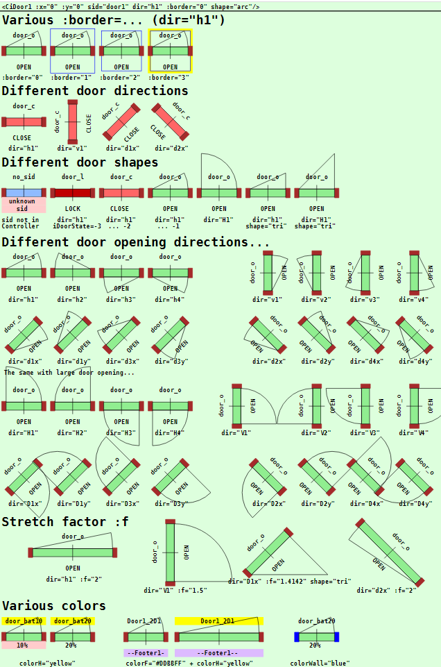
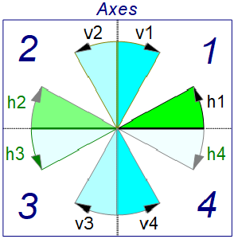
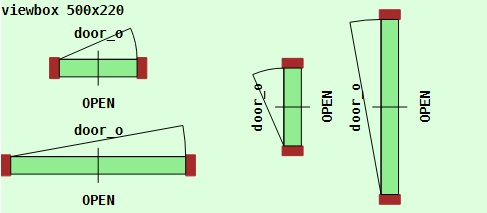

Last modified: 2023-02-18 <a name="up"></a>   
<table><tr><td></td><td>
<h1>Vue: Using the CiDoor1 symbol</h1>
<a href="../../README.md">==> Home page</a> &nbsp; &nbsp; &nbsp; 
<a href="./LIESMICH.md">==> German version</a> &nbsp; &nbsp; &nbsp; 
</td></tr></table><hr>

# Target
Getting to know all the ways to display and use a `CiDoor1` symbol.   
In general:   
* The `CiDoor1` symbol waits for MQTT messages to represent the state of the door (open, closed, locked).   
* All properties concerning the graphical representation of the symbol are set in the `<template>` area of the representation file (e.g. in `CiMain.vue`).   
* All non-graphical properties, such as ID, name, labels and MQTT functionality, are defined in the `CiDoor1Controller.ts` file.   

# Quick Reference
* Download directory `vuex320_ci_mqtt_CiDoor1`.   
* Start Visual Studio Code (VSC) with TypeScript support installed and open the folder of this Vue application.   
* In VSC open the terminal and type the following:   
`npm run serve`   
* Start the browser (e.g. Google Chrome) and call the page `localhost:8080`.   

In the browser the symbols shown in _Fig. 1_ (see below) are displayed.   

If you want to test the MQTT functionality, you have to run an MQTT broker (e.g. Mosquitto) on a computer (or Raspberry Pi) with the IP address `10.1.1.1`.   
* Connect the development computer to the network of the broker server. (For WLAN e.g. SSID `Raspi11`, password `12345678`)   
* Start Windows console (`cmd.exe`), change to the mosquitto directory and enter the following:   
`mosquitto_sub -h 10.1.1.1 -t "#" -v`   
* The CiDoor1 symbol waits for MQTT messages containing information about the door state and possibly the battery state. For simulation, these values can also be entered with the program `mosquitto_pub` in a Windows console:   
  * `mosquitto_pub -h 10.1.1.1 -t z2m/t/door/-1 -m "{\"contact\":false,\"battery\":90}"`   
  * `mosquitto_pub -h 10.1.1.1 -t z2m/t/door/-1 -m "{\"contact\":true,\"battery\":10}"`   
  * `mosquitto_pub -h 10.1.1.1 -t wifi/t/door/-5/ret/status -m 1`   

The values are displayed accordingly.   

Note: A detailed description of individual steps can be found in other chapters of the MQTT4HOME project.

## Graphic representation of a symbol
## General
The coding of the graphical representation of a CI symbol `CiXxx` is done in a file with a name like `CiXxx.vue`. These files are then used by the actual project file (e.g. `CiMain.vue`) to display the web page.   
The following image shows the output of this Vue application with the different `CiDoor1` representations. Which attributes cause which representation is described afterwards.     
   
_Fig. 1: Examples for different CiDoor1 representations_.   

## CiDoor1 call
The drawing of a CiDoor1 symbol is done in the `<template>` area of the presentation file (e.g. in `CiMain.vue`) by the tag `<CiDoor1>` and further attributes.   
_Example_:   
```   
<CiDoor1 :x="50" :y="70" sid="door_o" dir="h1"></CiDoor1>
```   

## Positioning of a symbol (:x, :y)
Normally CI symbols are 100x100 units in size and the center point (50/50) is used to indicate the position (placement point). If the drawing area is defined e.g. by   
`<svg width="100%" viewBox="0 0 500 220">`   
then the location specification `:x="50" :y="70"` causes the CiDoor1 to border the left edge and be 20 units away from the top edge:   
   
_Fig. 2: Location of a CiDoor1 symbol_   

_Note_:   
Remaining space at the bottom: 220 - 20 - 100 = 100 units.   
Remaining space right: 500 - 100 = 400 units   

## ID of a symbol (sid)
The symbol ID (sid) represents the connection of the graphical representation to the controller (see property [id](#id) in chapter "[Attributes defined in the base controller](#id)").

## Border of a symbol (:border)
Normally CI symbols are 100x100 units in size outside and have a fixed border of 5 units inside. With the CiWall1 symbol this is different:   
In order to make adjacent symbols in a 100 unit grid look continuous, the `CiDoor1` symbols go to the symbol border, so they are exceptionally 100x100 units in size.   
Normally, the border of the `CiDoor1` symbols is not displayed. If you want to display the border exceptionally, there are four ways to do so, which are set via the `:border=` attribute:   

| Parameter | Meaning |   
| ------------- | ------------------------------ |   
| `:border="0"` | No border will be displayed. |   
| `:border="1"` | Only the outer border of the symbol is displayed (= total space required by the symbol). |   
| `:border="2"` | Only the inner border of the symbol is shown (= the drawing area for the symbol). |   
| `:border="3"` | The border of the symbol is displayed in yellow. |   

Default is `:border="0"`.   

## Direction of the CiDoor1 symbol (dir)
The direction of a symbol is specified with the `dir` ("Direction") property.   

The __first letter__ indicates the base direction:   
* `h` or `H`: Horizontal (horizontal, x-direction).   
* `v` or `V`: Vertical (vertical, y-direction)   
* `d` or `D`: Diagonal (inclined at +/- 45°)   

If a lowercase letter is used, the door opening direction is drawn small, if an uppercase letter is used, it is drawn large (see _Fig. 1_).   

The __second letter__ indicates the opening direction, which is the quadrant into which the door opens. According to the 4 quadrants, the numbers 1 to 4 are possible.   

   
_Fig. 3: Direction labels for symbols in axis direction_   

For diagonal elements, a __third letter__ is required to indicate the `propagation` direction more precisely. The first letter is a `d` (for diagonal), the second letter indicates the diagonal direction for the symbol (`1` to `4`) and the third letter indicates the axis towards which an element opens (`x` or `y`).   

   
_Fig. 4: Directional labels for symbols in diagonal direction_   

__Examples of designations:__   
`dir="h1" ....` Horizontal symbol whose propagation (door opening) is in the first quadrant (towards "up").   
`dir="v1" ....` Vertical symbol, whose propagation (door opening) is in the first quadrant (to "right").   
`dir="d1x" ...` Diagonal symbol to the right-up, whose propagation (door opening) is in the direction of the x-direction (to "down").   

## Text information in CiDoor1 symbol (lines)
Each `CiDoor1` symbol knows three lines for text output:   
* header   
* line 4   
* footer   

Which texts are actually displayed in the symbol depends on the value of the 'lines=' attribute:    
| parameter | meaning |   
| ------------- | ------------------------------ |   
| `lines="0"`   | Neither header nor footer will be displayed. |   
| `lines="1"`   | The header line is displayed. If the `name` parameter is defined in the controller, this text is displayed, otherwise the `id`. |   
| `lines="2"`   | Header and footer are displayed.   |   

Default is `lines="2"`.   

### Header
1. If the attribute `lines="0"` is set in the symbol, the header will not be displayed.   
2. If the parameter `name` is defined in the controller, this text will be displayed.   
3. If the parameter `name` contains a question mark, it will be replaced by the text `OPEN`, `CLOSE` or `LOCK` depending on the door status.   
4. Otherwise the `id` is displayed.   

### Line 4
1. If the attribute `lines="0"` is set in the symbol, the line 4 will not be displayed.   
2. If the id of the symbol (`sid`) does not match any entry in the list `public door1s: Array<Door1>` (file `CiDoor1Controller.ts`), "`unknown`" is displayed.   
3. If there is a value for the MQTT key `battery`, this value is displayed.   
4. Otherwise, an empty line is output.   

### Footer
1. If the attribute `lines="0"` or `lines="1"` is set in the symbol, the footer will not be displayed.   
2. If the id of the symbol (`sid`) does not match any entry in the list `public door1s: Array<Door1>` (file `CiDoor1Controller.ts`), "`sid`" is displayed.   
3. If the `textF=` attribute is used in the symbol, this text will be displayed.   
4. If the `textFooter` parameter is defined in the controller, this text will be displayed.   
5. If the parameter `textFooter` contains a question mark, it will be replaced by the text `OPEN`, `CLOSE` or `LOCK` depending on the door status.   
6. Otherwise, an empty line is output.   

   
_Fig. 5: Miscellaneous footers_   

__Coding example__:   
```   
    <CiDoor1 :x="50"  :y="70" sid="doorX" dir="h1"></CiDoor1>
    <CiDoor1 :x="150" :y="70" sid="door_o" dir="h1"></CiDoor1>
    <CiDoor1 :x="350" :y="70" sid="door_o" dir="h1" lines="0"></CiDoor1>
    <CiDoor1 :x="50"  :y="170" sid="doorF" dir="h1"></CiDoor1>
    <CiDoor1 :x="150" :y="170" sid="doorF" dir="h1"></CiDoor1>
    <CiDoor1 :x="250" :y="170" sid="doorF" dir="h1"></CiDoor1>
    <CiDoor1 :x="350" :y="170" sid="doorF" dir="h1" textF="textF :)"></CiDoor1>
```   

## Stretching of a symbol (:f)
By default, all symbols are 100x100 units in size. However, it is possible to stretch the symbol (on both sides) so that the placement point remains the same.   
Stretching is done by specifying the `f` parameter, as the following example shows:   
   
_Fig. 6: Stretched CiDoor1 symbol_   

The symbol at the bottom left and far right are each stretched by a factor of 2.   

__Coding example__:   
```   
<template>
  <svg width="100%" viewBox="0 0 500 220">
  <rect class="ciBackground" x="0" y="0" width="500" height="220" />
  <text x="0" y="15" class="ciFont1">viewbox 500x220</text>
  <CiDoor1 :x="100" :y="70"  sid="door_o" dir="h1"></CiDoor1>
  <CiDoor1 :x="100" :y="170" sid="door_o" dir="h1" :f="2"></CiDoor1>
  <CiDoor1 :x="300" :y="110" sid="door_o" dir="v2"></CiDoor1>
  <CiDoor1 :x="400" :y="110" sid="door_o" dir="v2" :f="2"></CiDoor1>
  </svg>
</template>
```   

## Different CiDoor1 shapes (shape)
CiDoor1 symbols come in four forms, selected by the `dir=` and `shape=` attributes:   
### `dir`
* A lowercase letter results in a small arc or triangle that ends at the boundary of the drawing area.   
* An uppercase letter results in an arc or triangle corresponding to a quarter circle.   
### `shape`
* If you set `shape= "tri"`, a triangle will be drawn instead of an arc.   
The default is `shape="arc"`.   

## Colors in CiDoor1 symbol (colorH, colorF, colorWall)
The colors in the CiDoor1 symbol can be partially selected or are assigned automatically.   

### Automatically set colors
* Incorrect "`sid`", i.e. an object with this "`sid`" does not exist in the controller:   
* The door area is colored light blue (color "`colorUnknown`" from the file `Geo.ts`) and lines 4 and 5 are colored light red (color "`colorNotOK`" from the file `Geo.ts`).   
* The door area is colored according to the door status (variable `iDoor1State`):   
  * door open: light green (`colorOpen`)   
  * Door closed: light red (`colorClose`)   
  * Door locked: red (`colorLock`)   
* If a battery value is smaller than `batteryMin`, line 4 is colored light red (color "`colorNotOK`" from the file `Geo.ts`).   

### Selectable colors
* The `colorH=` attribute can be used to set the background color of the header. The value can be either an RGB value (red-green-blue value), such as `#ffee00` or a text specification such as `red`, `green` etc.   
* With the attribute `colorF=` the background color of the footer can be set (color value see above).   
* With the attribute `colorWall=` the color of the wall elements (rectangles left and right of the door area) can be set (color value see above).   

<a name="id"></a>   
# Non-graphical attributes
## Attributes defined in the base controller.
Attributes of CI symbols that have nothing to do with the graphical representation of the symbol are defined in "`xxxController.ts`" files.   
The following attributes are defined in the base controller (`CiBaseController.ts` file) and must be mandatory in all derived controllers:   
| Property     | Meaning                                  |   
| ------------ | ---------------------------------------- |   
| `id`         | Should normally be a unique name of a CiDoor1 symbol.    |   
| `subTopic`   | Messages or MQTT topics the CiDoor1 symbol "listens" to (can also be empty ''). |   
| `pubTopic`   | MQTT topics that the CiDoor1 symbol sends when clicked. |   

The following attributes are optional:   
| property     | meaning                              |   
| ------------ | ------------------------------------ |   
| `name`       | Name of a CiDoor1 symbol. Can be displayed in the header of the icon. |   
| `pubPayload` | Payload to be used when sending a message. |   


## Attributes defined in `CiDoor1Controller.ts`.
The following attributes are mandatory:   
| Property       | Meaning                              |   
| -------------- | ------------------------------------ |   
| `iDoor1State`  | Status of the CiDoor1. Use e.g. -99 as default for the start. |   
| `type`         | Sensor type that detects the door status and sends a corresponding MQTT message. |   

The following attributes are optional and can be used:   
| property | meaning |   
| ------------ | ------------------------------------ |   
| `battery` | Receive the state of charge if a CiDoor1 sensor is operated with battery. Can be displayed in the footer. |   
| `textHeader` | Text in the header of the symbol.    |   
| `textFooter` | Specify a fixed text in the footer.  |   

## Example: Coding of a `CiDoor1Controller.ts`.   
Normally, only the values within the `Array<Door1>` area need to be added.   
If one wants to implement additional MQTT functionality when receiving messages, the code in the `public onMessage (message: Message): void` method can be supplemented accordingly.   

In the example below, six door objects are defined:   
The first three objects `door_o`, `door_c` and `door_l` are used to represent open, closed and locked doors.   
The objects `door_bat10` and `door_bat20` are used to represent a battery value and `doorF` shows the display of a footer value.   

```
// ______CiDoor1Controller.ts____________________khartinger_____
// 2022-01-08: new
// 2023-02-18: change at CiBase (add Geo.ts)
import { reactive } from 'vue'
import { Message } from '@/services/CiMqttClient'
import { CiBaseController, IBase } from './CiBaseController'

export interface Door1 extends IBase {
  // ---------mandatory-----------------------------------------
  iDoor1State: number;
  type: string;
  // ---------optional------------------------------------------
  battery?: string;
  textHeader?: string;
  textFooter?: string;
}

export class CiDoor1Controller extends CiBaseController {
  public door1s: Array<Door1> = reactive(
    [
      {
        id: 'door_o',
        type: 'zb',
        iDoor1State: -1, // -1=open, -2=close, -3=lock
        textFooter: '?',
        subTopic: 'z2m/t/door/-1',
        pubTopic: '',
        pubPayload: '0'
      },
      {
        id: 'door_c',
        type: 'zb',
        iDoor1State: -2,
        textFooter: '?',
        subTopic: 'z2m/t/door/-2',
        pubTopic: '',
        pubPayload: '0'
      },
      {
        id: 'door_l',
        type: 'zb',
        iDoor1State: -3,
        textFooter: '?',
        subTopic: 'z2m/t/door/-3',
        pubTopic: '',
        pubPayload: '0'
      },
      {
        id: 'door_bat10',
        type: 'D1',
        iDoor1State: -1,
        battery: '10',
        subTopic: 'z2m/t/door/-4',
        pubTopic: '',
        pubPayload: '0'
      },
      {
        id: 'door_bat20',
        type: 'D1',
        iDoor1State: -1,
        battery: '20',
        subTopic: 'wifi/t/door/-5/ret/status wifi/t/door/-5/ret/voltage',
        pubTopic: '',
        pubPayload: '0'
      },

      {
        id: 'doorF',
        name: 'Door1_2D1',
        type: 'D1',
        iDoor1State: -99,
        textFooter: '--Footer1--',
        subTopic: 'wifi/t/door/-6/ret/status wifi/t/door/-6/ret/voltage',
        pubTopic: '',
        pubPayload: ''
      }

    ]
  );

  // --------------state constants------------------------------
  public stateOpen = -1;
  public stateClose = -2;
  public stateLock = -3;
  public stateNotOk = -998;
  public stateNoState = -999;

  public onMessage (message: Message): void {
    this.door1s.forEach(door1 => {
      const aSubTopic = door1.subTopic.split(' ')
      if (aSubTopic.includes(message.topic)) {
        // ---door1 topic found --------------------------------
        if (door1.type === 'zb') {
        // ---door type 1---------------------------------------
          try {
            const aPayload = JSON.parse(message.payload)
            door1.battery = `${aPayload.battery}`
            const doorstate_ = String(aPayload.contact)
            if (doorstate_ === 'true') door1.iDoor1State = this.stateClose
            else {
              if (doorstate_ === 'false') door1.iDoor1State = this.stateOpen
              else door1.iDoor1State = this.stateNotOk
            }
          } catch (error) { }
        }
        if (door1.type === 'D1') {
        // ---door type 2---------------------------------------
          if (message.topic.includes('status')) {
            if ((message.payload === '1') || (message.payload === 'on')) door1.iDoor1State = this.stateOpen
            else {
              if ((message.payload === '0') || (message.payload === 'off')) door1.iDoor1State = this.stateClose
              else {
                if (message.payload === '-1') door1.iDoor1State = this.stateLock
                else door1.iDoor1State = this.stateNotOk
              }
            }
          }
          if (message.topic.includes('voltage')) {
            door1.battery = `${message.payload}`
          }
        }
        // ---door type 3---------------------------------------
        if (door1.type === 'something_else') {
          try {
            // ...add functionality for another sensor here...
          } catch (error) { }
        } // ------END work on different door1 types------------
        // ---END door1 topic found ----------------------------
      }
    })
  }

  public publishCi (topic: string, payload: string): void {
    // console.log('CiDoor1Controller:publishCi:', '-t ' + topic + ' -m ' + payload)
    this.publish(topic, payload, false, 0).catch((e) => { console.error('CiDoor1Controller: ERROR:', e) })
  }
}

export const ciDoor1Controller = new CiDoor1Controller()
```

[Top of page](#up)
