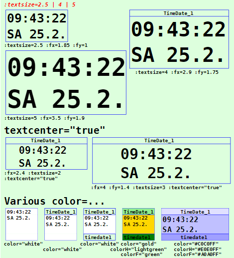

Letzte &Auml;nderung: 25.2.2023 <a name="up"></a>   
<table><tr><td></img></td><td>
<h1>Vue: Verwendung des CiTimeDate1-Symbols</h1>
<a href="../../LIESMICH.md">==> Startseite</a> &nbsp; &nbsp; &nbsp; 
<a href="./README.md">==> English version</a> &nbsp; &nbsp; &nbsp; 
</td></tr></table><hr>
  
# Ziel
Kennenlernen aller M&ouml;glichkeiten zur Darstellung und Verwendung eines `CiTimeDate1`-Symbols.   
Allgemein gilt:   
* Das `CiTimeDate1`-Symbol zeigt die aktuelle Uhrzeit und das Datum an.   
* Alle Eigenschaften, die die grafische Darstellung des Symbols betreffen, werden im `<template>`-Bereich der Darstellungsdatei (zB in `CiMain.vue`) festgelegt.   
* Alle nicht grafischen Eigenschaften, wie ID, Name, Beschriftungen und MQTT-Funktionalit&auml;t, werden in der Datei `CiTimeDate1Controller.ts` definiert.   

# Kurzanleitung
* Verzeichnis `vuex410_ci_mqtt_timedate1` herunterladen.   
* Visual Studio Code (VSC) mit installierter TypeScript-Unterst&uuml;tzung starten und den Ordner dieser Vue-Anwendung &ouml;ffnen.   
* In VSC das Terminal &ouml;ffnen und folgendes eingeben:   
`npm run serve`   
* Den Browser (zB Google Chrome) starten und die Seite `localhost:8080` aufrufen.   

Im Browser werden die im _Bild 1_ (siehe unten) dargestellten Symbole angezeigt.   

Anmerkung: Eine detaillierte Beschreibung zu einzelnen Schritten befindet sich in anderen Kapiteln des Projektes MQTT4HOME.

# Grafische Darstellung eines Ci-Symbols
## Allgemeines
Die Codierung der grafischen Darstellung eines CI-Symbols `CiXxx` erfolgt in einer Datei mit dem Namen wie `CiXxx.vue`. Diese Dateien werden dann von der eigentlichen Projektdatei (zB. `CiMain.vue`) verwendet, um die Web-Seite darzustellen.   
Das folgende Bild zeigt die Ausgabe dieser Vue-Anwendung mit den verschiedenen `CiTimeDate1`-Darstellungen. Welche Attribute welche Darstellung bewirken, wird anschlie&szlig;end beschrieben.     
   
   
_Bild 1: Beispiele f&uuml;r verschiedene CiTimeDate1-Darstellungen_   

## CiTimeDate1-Aufruf
Das Zeichnen eines CiTimeDate1-Symbols erfolgt im `<template>`-Bereich der Darstellungsdatei (zB in `CiMain.vue`) durch das Tag `<CiTimeDate1>` und die Angabe weiterer Attribute.   
_Beispiel_:   
```   
<CiTimeDate1 :x="470" :y="440" sid="timedate1" :fx=2.2 :fy=1.2 :textsize=3 lines="0" :border="2"></CiTimeDate1>
```   

## Positionierung eines Symbols (x, y)
Im Normalfall sind CI-Symbole 100x100 Einheiten gro&szlig; und der Mittelpunkt (50/50) dient zur Positionsangabe (Platzierungspunkt). Ist der Zeichenbereich zB durch   
`<svg width="100%" viewBox="0 0 500 220">`   
definiert, so bewirkt die Ortsangabe `:x="50" :y="70"`, dass das CiTimeDate1-Symbol an den linken Rand grenzt und 20 Einheiten vom oberen Rand entfernt ist:   
   
_Bild 2: Ort eines CiTimeDate1-Symbols_   

_Anmerkung_:   
Restlicher Platz unten: 220 - 20 - 100 = 100 Einheiten   
Restlicher Platz rechts: 500 - 100 = 400 Einheiten   

## ID eines Symbols (sid)
Die Symbol-ID (sid) stellt die Verbindung zwischen der grafischen Darstellung und dem Controller dar (siehe Eigenschaft [id](#id) im Kapitel "[Im Basis-Controller definierte Attribute](#id)")

## Rand eines Symbols (border)
Alle CI-Symbole sind im Normalfall au&szlig;en 100x100 Einheiten gro&szlig; und haben nach innen einen fixen Rand von 5 Einheiten. Die individuelle "Arbeitsfl&auml;che" eines Symbols ist also 90 x 90 Einheiten gro&szlig;.   
Durch den Rand ist es m&ouml;glich, Symbole direkt nebeneinander in einem 100er-Raster anzuordnen, ohne dass sich die Symbol-Zeichnungen optisch ber&uuml;hren.   
Will man den Rand eines CI-Symbols darstellen, so gibt es dazu vier M&ouml;glichkeiten, die &uuml;ber das Attribut `:border=` eingestellt werden:   

| Parameter     | Bedeutung                      |   
| ------------- | ------------------------------ |   
| `:border="0"` | Es wird kein Rand dargestellt. |   
| `:border="1"` | Es wird nur der &auml;u&szlig;ere Rand des Symbols dargestellt (= gesamter Platzbedarf des Symbols). |   
| `:border="2"` | Es wird nur der innere Rand des Symbols dargestellt (= der Zeichenbereich f&uuml;r das Symbol). |   
| `:border="3"` | Es wird der Rand des Symbols gelb angezeigt. |   

Vorgabe ist `:border="0"`   

## Textangaben im CiTimeDate1-Symbol (lines)
Jedes `CiTimeDate1`-Symbol kennt drei m&ouml;gliche Bereiche zur Textausgabe:   
* Kopfzeile   
* Fu&szlig;zeile   
* Zeichenbereich (= Textbereich)   

Welche Texte des Kopf- und Fu&szlig;bereichs im Symbol wirklich angezeigt werden, h&auml;ngt vom Wert des Attributs `lines=` ab:    
| Parameter     | Bedeutung                      |   
| ------------- | ------------------------------ |   
| `lines="0"`   | Weder Kopfzeile noch Fu&szlig;zeile werden angezeigt. |   
| `lines="1"`   | Die Kopfzeile wird angezeigt. Ist im Controller der Parameter `name` definiert, so wird dieser Text angezeigt, ansonsten die `id`. |   
| `lines="2"`   | Kopf- und Fu&szlig;zeile werden angezeigt.<br>Kopfzeile: Ist im Controller der Parameter `name` definiert, so wird dieser Text angezeigt, ansonsten die `id`.<br>Fu&szlig;zeile: Ist im Controller der Parameter `textFooter` definiert, so wird dieser Text angezeigt, ansonsten die `id`. |   

Vorgabe ist `lines="0"`   

Je nach Anzahl angezeigter Zeilen ver&auml;ndert sich die Gr&ouml;&szlig;e des Zeichenbereichs f&uuml;r das CI-Symbol. F&uuml;r das Standard-Symbol mit der Gesamtgr&ouml;&szlig;e 100x100 gilt:   
* `lines="0"`: Zeichenbereich 90x90 Einheiten   
* `lines="1"`: Zeichenbereich 90x72 Einheiten   
* `lines="2"`: Zeichenbereich 90x54 Einheiten   

## Strecken eines Symbols (fx, fy)
Standardm&auml;&szlig;ig sind alle Symbole 100x100 Einheiten gro&szlig;. Es ist jedoch m&ouml;glich, die Symbole in x- und in y-Richtung zu strecken. Der Platzierungspunkt bleibt dabei gleich.   
Das Strecken erfolgt durch Angabe der Parameter `fx` und `fy`, wie das folgende Bild zeigt:   
   
_Bild 3: Gestrecktes CiTimeDate1-Symbol_   

Die linken beiden CiTimeDate1-Symbole sind um den Faktor fx=2 gestreckt (ergibt 2*100 = 200 Einheiten), das dritte Symbol ist um den Faktor fy=2 gesteckt und das rechte Symbol ist um fx=2 und fy=2 gestreckt, d.h., es ist mit einer Gr&ouml;&szlig;e von 200x200 doppelt so gro&szlig; wie das Original.   

__Codierungsbeispiel__:   
```   
<template>
  <svg width="100%" viewBox="0 0 500 220">
  <rect class="ciBackground" x="0" y="0" width="500" height="220" />
  <text x="0" y="15" class="ciFont1">viewbox 500x220</text>
  <CiTimeDate1 :x="50" :y="70"  sid="timedate1" :fx="2" :fy="1"></CiTimeDate1>
  <CiTimeDate1 :x="50" :y="170" sid="textarea2" :fx="2" :fy="1"></CiTimeDate1>
  <CiTimeDate1 :x="250" :y="70" sid="timedate1" :fx="1" :fy="2"></CiTimeDate1>
  <CiTimeDate1 :x="350" :y="70" sid="textarea2" :fx="2" :fy="2"></CiTimeDate1>
  </svg>
</template>
```   

## Farbe des CiTimeDate1-Symbols (color, colorH, colorF)
Mit Hilfe des Attributs `color=` kann die Hintergrundfarbe eines CiTimeDate1-Symbols gew&auml;hlt werden. Der Wert kann entweder ein RGB-Wert (rot-gr&uuml;n-blau-Wert), wie zB `#eedd00` oder eine Textangabe wie `red`, `white` etc. sein.   
Wird kein Wert angegeben, so ist das Symbol transparent, das hei&szlig;t, es hat die Hintergrundfarbe.   
Weiters kann mit Hilfe des Attributs `colorH=` die Hintergrundfarbe der Kopfzeile ("header") bzw. mit `colorF=` die Hintergrundfarbe der Fu&szlig;zeile ("footer") festgelegt werden.   

## Textgr&ouml;&szlig;e (:textsize)
Die Standard-Schriftgr&ouml;&szlig;e ist so gew&auml;hlt, dass im 100x100 gro&szlig;en Standardsymbol f&uuml;nf Zeilen Platz haben [Zeilenh&ouml;he = (100 - 2x5 Rand) / 5 = 18 Einheiten). Mit dem Parameter `textsize` kann die Schriftgr&ouml;&szlig;e ver&auml;ndert werden:   
| Parameter           | Bedeutung                                |   
| ------------------- | ---------------------------------------- |   
| `:textsize="1.5"`   | Schrifth&ouml;he ist 1,5 Zeilen hoch. Das ergibt z.B. zwei Zeilen im Zeichenbereich bei `lines="2"`   |   
| `:textsize="2"`   | Schrifth&ouml;he ist 2 Zeilen hoch. Das ergibt z.B. zwei Zeilen bei `lines="1"`   |   
| `:textsize="3"`   | Schrifth&ouml;he ist 3 Zeilen hoch. Das ergibt z.B. eine Zeile bei `lines="2"`   |   
| `:textsize="4"`   | Schrifth&ouml;he ist 4 Zeilen hoch. Das ergibt z.B. eine Zeile bei `lines="1"`   |   
| `:textsize="5"`   | Schrifth&ouml;he ist 5 Zeilen hoch. Das ergibt z.B. eine Zeile bei `lines="0"`   |   

   
_Bild 4: Verschiedene Schriftgr&ouml;&szlig;en im Zeichenbereich_   


<a name="id"></a>   
# Nicht-grafische Eigenschaften
## Im Basis-Controller definierte Attribute
Eigenschaften von CI-Symbolen, die nichts mit der grafischen Darstellung des Symbols zu tun haben, werden in "`xxxController.ts`"-Dateien definiert.   
Folgende Attribute sind im Basis-Controller (Datei `CiBaseController.ts`) definiert und m&uuml;ssen in allen abgeleiteten Controllern zwingend angegeben werden:   
| Eigenschaft  | Bedeutung                                |   
| ------------ | ---------------------------------------- |   
| `id`         | Sollte im Normalfall eine eindeutige Bezeichnung eines CiTimeDate1-Symbols sein.    |   
| `subTopic`   | Nachrichten bzw. MQTT-Topics, auf die das CiTimeDate1-Symbol "h&ouml;rt" (kann auch leer '' sein). |   
| `pubTopic`   | MQTT-Topics, die das CiTimeDate1-Symbol beim Klicken sendet. |   

Folgende Attribute sind optional:   
| Eigenschaft  | Bedeutung                            |   
| ------------ | ------------------------------------ |   
| `name`       | Name eines CiTimeDate1-Symbols. Kann in der Kopfzeile des Symbols angezeigt werden. |   
| `pubPayload` | Payload, die beim Senden einer Nachricht verwendet werden soll. |   


## In `CiTimeDate1Controller.ts` definierte Eigenschaften
Folgende Attribute sind zwingend anzugeben:   
| Eigenschaft       | Bedeutung                            |   
| ----------------- | ------------------------------------ |   
| `iTimeDate1State` | Status des CiTimeDate1-Symbols. Hat derzeit keine Funktion. |   

Folgende Attribute sind optional und k&ouml;nnen bei Bedarf verwendet werden:   
| Eigenschaft  | Bedeutung                            |   
| ------------ | ------------------------------------ |   
| `textFooter` | Angabe eines fixen Textes in der Fu&szlig;zeile. |   

## Beispiel: Codierung des `CiTimeDate1Controller.ts`   
Im Normalfall m&uuml;ssen nur die Werte innerhalb des Bereichs `Array<CiTimeDate1>` erg&auml;nzt werden.   

M&ouml;chte man zus&auml;tzliche MQTT-Funktionalit&auml;ten beim Empfang von Nachrichten implementieren, so kann der Code in der Methode `public onMessage (message: Message): void` entsprechend erg&auml;nzt werden.   

```
// ______CiTimeDate1Controller.ts________________khartinger_____
// 2023-02-25: New

import { reactive } from 'vue'
import { Message } from '@/services/CiMqttClient'
import { CiBaseController, IBase } from './CiBaseController'

export interface TimeDate1 extends IBase {
  // ---------mandatory-----------------------------------------
  iTimeDate1State: number; //
  // ---------optional------------------------------------------
  textFooter?: string;
}

export class CiTimeDate1Controller extends CiBaseController {
  public timedate1s: Array<TimeDate1> = reactive(
    [
      {
        id: 'timedate1',
        name: 'TimeDate_1',
        iTimeDate1State: -1,
        subTopic: 'ci/timeDate/set',
        pubTopic: ''
      }
    ]
  );

  // ---------Message for this ci (control/indicator)?----------
  public onMessage (message: Message): void {
    // -------search for topic timedate1------------------------
    this.timedate1s.forEach(timedate1 => {
      const aSubTopic = timedate1.subTopic.split(' ')
      if (aSubTopic.includes(message.topic)) {
        // ---timedate1 topic found ----------------------------
        if (timedate1.id === 'something_else') {
          try {
            // ...add functionality for symbol here...
          } catch (error) { }
        }
      } // ---END timedate1 topic found-------------------------
    })
  }

  public publishCi (topic: string, payload: string): void {
    // console.log('publish:', '-t ' + topic + ' -m ' + payload)
    this.publish(topic, payload, false, 0).catch((e) => { console.error('CiTimeDate1Controller: ERROR:', e) })
  }
}

export const ciTimeDate1Controller = new CiTimeDate1Controller()
```

[Zum Seitenanfang](#up)
