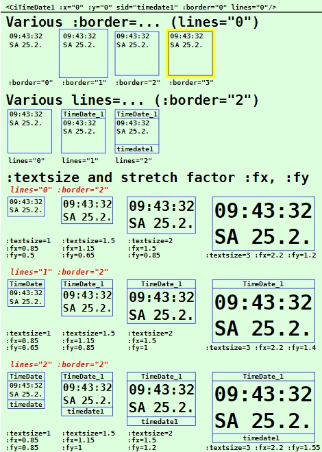
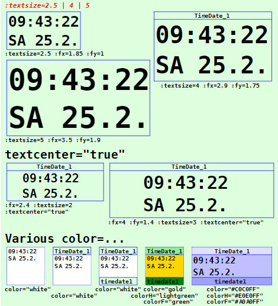
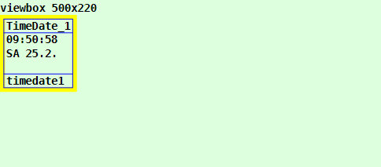
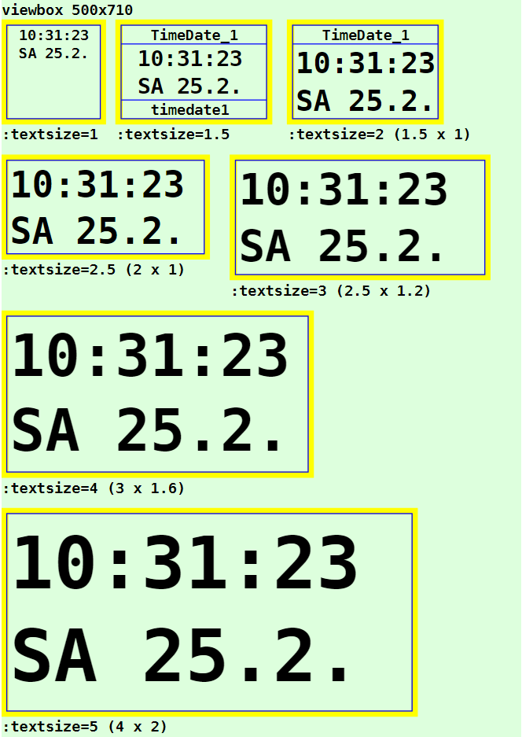

Last modified: 2023-02-25 <a name="up"></a>   
<table><tr><td></td><td>
<h1>Vue: Using the CiTimeDate1 symbol</h1>
<a href="../../README.md">==> Home page</a> &nbsp; &nbsp; &nbsp; 
<a href="./LIESMICH.md">==> German version</a> &nbsp; &nbsp; &nbsp; 
</td></tr></table><hr>

# Target
Getting to know all the ways to display and use a `CiTimeDate1` symbol.   
In general:   
* The `CiTimeDate1` symbol shows the current time and date.   
* All properties concerning the graphical representation of the symbol are set in the `<template>` area of the representation file (e.g. in `CiMain.vue`).   
* All non-graphical properties, such as ID, name, labels and MQTT functionality, are defined in the `CiTimeDate1Controller.ts` file.   

# Quick Reference
* Download directory `vue150_ci_mqtt_CiTimeDate1`.   
* Start Visual Studio Code (VSC) with TypeScript support installed and open the folder of this Vue application.   
* In VSC open the terminal and type the following:   
`npm run serve`   
* Start the browser (e.g. Google Chrome) and call the page `localhost:8080`.   

In the browser the symbols shown in _Fig. 1_ (see below) are displayed.   

Note: A detailed description of individual steps can be found in other chapters of the MQTT4HOME project.

## Graphic representation of a ci symbol
## General
The coding of the graphical representation of a CI symbol `CiXxx` is done in a file with a name like `CiXxx.vue`. These files are then used by the actual project file (e.g. `CiMain.vue`) to display the web page.   
The following image shows the output of this Vue application with the different `CiTimeDate1` representations. Which attributes cause which representation is described afterwards.     
   
   
_Fig. 1: Examples for different CiTimeDate1 representations_.   

## CiTimeDate1 call
The drawing of a CiTimeDate1 symbol is done in the `<template>` area of the presentation file (e.g. in `CiMain.vue`) by the tag `<CiTimeDate1>` and further attributes.   
_Example_:   
```   
<CiTimeDate1 :x="470" :y="440" sid="timedate1" :fx=2.2 :fy=1.2 :textsize=3 lines="0" :border="2"></CiTimeDate1>
```   

## Positioning of a symbol (x, y)
Normally CI symbols are 100x100 units in size and the center point (50/50) is used to indicate the position (placement point). If the drawing area is defined e.g. by   
`<svg width="100%" viewBox="0 0 500 220">`   
then the location specification `:x="50" :y="70"` causes the CiTimeDate1 to border the left edge and be 20 units away from the top edge:   
   
_Fig. 2: Location of a CiTimeDate1 symbol_   

_Note_:   
Remaining space at the bottom: 220 - 20 - 100 = 100 units.   
Remaining space right: 500 - 100 = 400 units   

## ID of a symbol (sid)
The symbol ID (sid) represents the connection of the graphical representation to the controller (see property [id](#id) in chapter "[Attributes defined in the base controller](#id)").

## Border of a symbol (border)
All CI symbols are normally 100x100 units on the outside and have a fixed margin of 5 units on the inside. So the individual "workspace" of a symbol is 90x90 units.   
The margin makes it possible to arrange symbols directly next to each other in a 100-unit grid without the symbol drawings visually touching each other.   
If you want to display the border of a CI symbol, there are four possibilities for this, which are set via the attribute `:border=`:   

| Parameter | Meaning |   
| ------------- | ------------------------------ |   
| `:border="0"` | No border will be displayed. |   
| `:border="1"` | Only the outer border of the symbol is displayed (= total space required by the symbol). |   
| `:border="2"` | Only the inner border of the symbol is shown (= the drawing area for the symbol). |   
| `:border="3"` | The border of the symbol is displayed in yellow. |   

Default is `:border="0"`.   

## Text information in CiTimeDate1 symbol (lines)
Each `CiTimeDate1` symbol knows three possible areas for text output:   
* header   
* footer   
* drawing area (= text area)   

Which texts of the header and footer actually are displayed in the symbol depends on the value of the 'lines=' attribute:    
| parameter | meaning |   
| ------------- | ------------------------------ |   
| `lines="0"`   | Neither header nor footer will be displayed. |   
| `lines="1"`   | The header line is displayed. If the `name` parameter is defined in the controller, this text is displayed, otherwise the `id`. |   
| `lines="2"`   | Header and footer are displayed.<br>Header: If the parameter `name` is defined in the controller, this text is displayed, otherwise the `id`.<br>Footer: If the `textFooter` parameter is defined in the controller, this text is displayed, otherwise the `id`. |  

Default is `lines="0"`.   

Depending on the number of displayed lines, the size of the drawing area for the CI symbol changes. For the standard symbol with the total size 100x100 applies:   
* `lines="0"`: character area 90x90 units   
* `lines="1"`: drawing area 90x72 units   
* `lines="2"`: drawing area 90x54 units   

## Stretching of a symbol (fx, fy)
By default, all symbols are 100x100 units in size. However, it is possible to stretch the symbols in x and in y direction. The placement point remains the same.   
Stretching is done by specifying the parameters `fx` and `fy`, as the following example shows:   
   
_Fig. 3: Stretched CiTimeDate1 symbol_   

The left two CiTimeDate1 symbols are stretched by the factor fx=2 (results in 2*100 = 200 units), the third symbol is stretched by the factor fy=2 and the right symbol is stretched by fx=2 and fy=2, i.e. it is twice as large as the original with a size of 200x200.   

__Coding example__:   
```   
<template>
  <svg width="100%" viewBox="0 0 500 220">
  <rect class="ciBackground" x="0" y="0" width="500" height="220" />
  <text x="0" y="15" class="ciFont1">viewbox 500x220</text>
  <CiTimeDate1 :x="50" :y="70"  sid="timedate1" :fx="2" :fy="1"></CiTimeDate1>
  <CiTimeDate1 :x="50" :y="170" sid="textarea2" :fx="2" :fy="1"></CiTimeDate1>
  <CiTimeDate1 :x="250" :y="70" sid="timedate1" :fx="1" :fy="2"></CiTimeDate1>
  <CiTimeDate1 :x="350" :y="70" sid="textarea2" :fx="2" :fy="2"></CiTimeDate1>
  </svg>
</template>
```   

## Color of the CiTimeDate1 symbol  (color, colorH, colorF)
With the help of the attribute `color=` the background color of a CiTimeDate1 symbol can be chosen. The value can either be an RGB value (red-green-blue value) like `#eedd00` or a text value like `red`, `white` etc..   
If no value is specified, the symbol is transparent, i.e. it has the background color.   
Furthermore, the `colorH=` attribute can be used to specify the background color of the header and `colorF=` to specify the background color of the footer.

## Text size (:textsize)
The default font size is such that there is room for five lines in the 100x100 standard symbol [line height = (100 - 2x5 margin) / 5 = 18 units). The `textsize` parameter can be used to change the font size:   
| parameter | meaning |   
| ------------------- | ---------------------------------------- |   
| `:textsize="1.5"` | font size is 1.5 lines high. This results e.g. in two lines in the character area with `lines="2"` |   
| `:textsize="2"` | font height is 2 lines high. This results e.g. in two lines with `lines="1"` |   
| `:textsize="3"` | font height is 3 lines high. This results in e.g. one line with `lines="2"` |   
| `:textsize="4"` | Font size is 4 lines high. This results e.g. in one line with `lines="1"` |   
| `:textsize="5"` | Font size is 5 lines high. This results e.g. in one line with `lines="0"` |   

   
_Fig. 4: Different font sizes in the character area_


<a name="id"></a>   
# Non-graphical attributes
## Attributes defined in the base controller.
Attributes of CI symbols that have nothing to do with the graphical representation of the symbol are defined in "`xxxController.ts`" files.   
The following attributes are defined in the base controller (`CiBaseController.ts` file) and must be mandatory in all derived controllers:   
| Property     | Meaning                                  |   
| ------------ | ---------------------------------------- |   
| `id`         | Should normally be a unique name of a CiTimeDate1 symbol.    |   
| `subTopic`   | Messages or MQTT topics the CiTimeDate1 symbol "listens" to (can also be empty ''). |   
| `pubTopic`   | MQTT topics that the CiTimeDate1 symbol sends when clicked. |   

The following attributes are optional:   
| property     | meaning                              |   
| ------------ | ------------------------------------ |   
| `name`       | Name of a CiTimeDate1 symbol. Can be displayed in the header of the icon. |   
| `pubPayload` | Payload to be used when sending a message. |   


## Attributes defined in `CiTimeDate1Controller.ts`.
The following attributes are mandatory:
| property     | meaning                              |   
| ------------ | ------------------------------------ |   
| `iTimeDate1State` | State of the CiTimeDate1 symbol. Has no function at the moment. |   

The following attributes are optional and can be used if required:   
| property     | meaning                              |   
| ------------ | ------------------------------------ |   
| `textFooter` | Specification of a fixed text in the footer line. |   

## Example: Coding of the `CiTimeDate1Controller.ts`.   
Normally, only the values within the `Array<CiTimeDate1>` area need to be added.   

If one wants to implement additional MQTT functionality when receiving messages, the code in the `public onMessage (message: Message): void` method can be supplemented accordingly.   

```
// ______CiTimeDate1Controller.ts________________khartinger_____
// 2023-02-25: New

import { reactive } from 'vue'
import { Message } from '@/services/CiMqttClient'
import { CiBaseController, IBase } from './CiBaseController'

export interface TimeDate1 extends IBase {
  // ---------mandatory-----------------------------------------
  iTimeDate1State: number; //
  // ---------optional------------------------------------------
  textFooter?: string;
}

export class CiTimeDate1Controller extends CiBaseController {
  public timedate1s: Array<TimeDate1> = reactive(
    [
      {
        id: 'timedate1',
        name: 'TimeDate_1',
        iTimeDate1State: -1,
        subTopic: 'ci/timeDate/set',
        pubTopic: ''
      }
    ]
  );

  // ---------Message for this ci (control/indicator)?----------
  public onMessage (message: Message): void {
    // -------search for topic timedate1------------------------
    this.timedate1s.forEach(timedate1 => {
      const aSubTopic = timedate1.subTopic.split(' ')
      if (aSubTopic.includes(message.topic)) {
        // ---timedate1 topic found ----------------------------
        if (timedate1.id === 'something_else') {
          try {
            // ...add functionality for symbol here...
          } catch (error) { }
        }
      } // ---END timedate1 topic found-------------------------
    })
  }

  public publishCi (topic: string, payload: string): void {
    // console.log('publish:', '-t ' + topic + ' -m ' + payload)
    this.publish(topic, payload, false, 0).catch((e) => { console.error('CiTimeDate1Controller: ERROR:', e) })
  }
}

export const ciTimeDate1Controller = new CiTimeDate1Controller()
```

[Top of page](#up)
