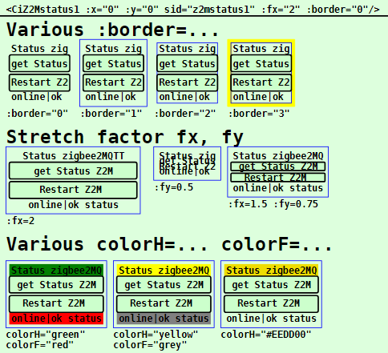
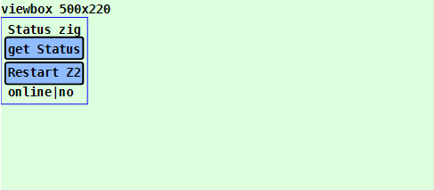
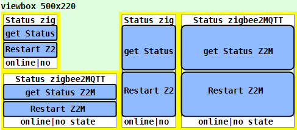

Letzte &Auml;nderung: 5.3.2023 <a name="up"></a>   
<table><tr><td></img></td><td>
<h1>Vue: Verwendung des CiZ2Mstatus1-Symbols</h1>
<a href="../../LIESMICH.md">==> Startseite</a> &nbsp; &nbsp; &nbsp; 
<a href="./README.md">==> English version</a> &nbsp; &nbsp; &nbsp; 
</td></tr></table><hr>
  
# Ziel
Kennenlernen aller M&ouml;glichkeiten zur Darstellung und Verwendung eines `CiZ2Mstatus1`-Symbols.   
Allgemein gilt:   
* Das `CiZ2Mstatus1`-Symbol dient zum Abfragen des Zustandes einer Zigbee2MQTT-Br&uuml;cke (zB Sonoff Zigbee 3.0 USB Dongle Plus Modell ZBDongle-P).   
* Klickt man auf die obere H&auml;lfte des `CiZ2Mstatus1`-Symbols, so wird der Status der Zigbee2MQTT-Br&uuml;cke ("Gesundgeitscheck") abgefragt.   
* Klickt man auf die untere H&auml;lfte des `CiZ2Mstatus1`-Symbols, so wird eine Neustart-MQTT-Nachricht zur Zigbee2MQTT-Br&uuml;cke gesendet.   
* Alle Eigenschaften, die die grafische Darstellung des Symbols betreffen, werden im `<template>`-Bereich der Darstellungsdatei (zB in `CiMain.vue`) festgelegt.   
* Alle nicht grafischen Eigenschaften, wie ID, Name, Beschriftungen und MQTT-Funktionalit&auml;t, werden in der Datei `CiZ2Mstatus1Controller.ts` definiert.   

# Kurzanleitung
* Verzeichnis `vuex510_ci_mqtt_z2mstatus1` herunterladen.   
* Visual Studio Code (VSC) mit Vue 3 + TypeScript Unterst&uuml;tzung starten und den Ordner dieser Vue-Anwendung &ouml;ffnen.   
* In VSC das Terminal &ouml;ffnen und folgendes eingeben:   
`npm run serve`   
* Den Browser (zB Google Chrome) starten und die Seite `localhost:8080` aufrufen.   

Im Browser werden die im _Bild 1_ (siehe unten) dargestellten Symbole angezeigt.   

Will man die MQTT-Funktionalit&auml;t ohne Zigbee2MQTT-Bridge testen, so muss auf einem Rechner (bzw. Raspberry Pi) mit der IP-Adresse `10.1.1.1` ein MQTT-Broker laufen (zB Mosquitto).   
* Entwicklungsrechner mit dem Netzwerk des Broker-Servers verbinden. (Bei WLAN zB SSID `Raspi11`, Passwort `12345678`)   
* Windows-Konsole (`cmd.exe`) starten, ins mosquitto-Verzeichnis wechseln und folgendes eingeben:   
`mosquitto_sub -h 10.1.1.1 -t "#" -v`   
* Das CiZ2mStatus1-Symbol wartet auf MQTT-Nachrichten, die Informationen zur Zigbee2MQTT-Bridge enthalten. Zur Simulation k&ouml;nnen verschiedene Antwort-Werte auch mit dem Programm `mosquitto_pub` in einer Windows-Konsole eingegeben werden:   
* `mosquitto_pub -h 10.1.1.1 -t z2m/bridge/state -m offline`   
* `mosquitto_pub -h 10.1.1.1 -t z2m/bridge/state -m online`   
* `mosquitto_pub -h 10.1.1.1 -t z2m/bridge/response/restart -m "{\"data\":{},\"status\":\"ok\"}"`   
* `mosquitto_pub -h 10.1.1.1 -t z2m/bridge/response/restart -m "{\"data\":{},\"status\":\"error\"}"`   
* `mosquitto_pub -h 10.1.1.1 -t z2m/bridge/response/health_check -m "{\"data\":{\"healthy\":true},\"status\":\"ok\"}"`   

Anmerkung: Eine detaillierte Beschreibung zu einzelnen Schritten befindet sich in anderen Kapiteln des Projektes MQTT4HOME.

# Grafische Darstellung eines Symbols
## Allgemeines
Die Codierung der grafischen Darstellung eines CI-Symbols `CiXxx` erfolgt in einer Datei mit dem Namen wie `CiXxx.vue`. Diese Dateien werden dann von der eigentlichen Projektdatei (zB. `CiMain.vue`) verwendet, um die Web-Seite darzustellen.   
Das folgende Bild zeigt die Ausgabe dieser Vue-Anwendung mit verschiedenen `CiZ2Mstatus1`-Gr&ouml;&szlig;en. Welche Attribute welche Darstellung bewirken, wird anschlie&szlig;end beschrieben.     
   
_Bild 1: Beispiele f&uuml;r verschiedene CiZ2Mstatus1-Darstellungen_   

## Erzeugen des CiZ2Mstatus1-Symbols
Das Zeichnen eines CiZ2Mstatus1-Symbols erfolgt im `<template>`-Bereich der Darstellungsdatei (zB in `CiMain.vue`) durch das Tag `<CiZ2Mstatus1>` und weiteren Attributen.   
_Beispiel_:   
```   
<CiZ2Mstatus1 :x="50" :y="70"  sid="z2mstatus1" :fx="1.5" :fy="1" colorH="white" colorF="white" :border="3"></CiZ2Mstatus1>
```   

## Positionierung eines Symbols (x, y)
Im Normalfall sind CI-Symbole 100x100 Einheiten gro&szlig; und der Mittelpunkt (50/50) dient zur Positionsangabe (Platzierungspunkt). Ist der Zeichenbereich zB durch   
`<svg width="100%" viewBox="0 0 500 220">`   
definiert, so bewirkt die Ortsangabe `:x="50" :y="70"`, dass das CiZ2Mstatus1-Symbol an den linken Rand grenzt und 20 Einheiten vom oberen Rand entfernt ist:   
   
_Bild 2: Ort eines CiZ2Mstatus1-Symbols_   

_Anmerkung_:   
Restlicher Platz unten: 220 - 20 - 100 = 100 Einheiten   
Restlicher Platz rechts: 500 - 100 = 400 Einheiten   

## ID eines Symbols (sid)
Die Symbol-ID (sid) stellt die Verbindung zwischen der grafischen Darstellung und dem Controller dar (siehe Eigenschaft [id](#id) im Kapitel "[Im Basis-Controller definierte Attribute](#id)")

## Randes eines Symbols (:border)
Alle CI-Symbole sind im Normalfall au&szlig;en 100x100 Einheiten gro&szlig; und haben nach innen einen fixen Rand von 5 Einheiten. Die individuelle "Arbeitsfl&auml;che" eines Symbols ist also 90 x 90 Einheiten gro&szlig;.   
Durch den Rand ist es m&ouml;glich, Symbole direkt nebeneinander in einem 100er-Raster anzuordnen, ohne dass sich die Symbol-Zeichnungen optisch ber&uuml;hren.   
Will man den Rand eines CI-Symbols darstellen, so gibt es dazu vier M&ouml;glichkeiten, die &uuml;ber das Attribut `:border=` eingestellt werden:   

| Parameter     | Bedeutung                      |   
| ------------- | ------------------------------ |   
| `:border="0"` | Es wird kein Rand dargestellt. |   
| `:border="1"` | Es wird nur der &auml;u&szlig;ere Rand des Symbols dargestellt (= gesamter Platzbedarf des Symbols). |   
| `:border="2"` | Es wird nur der innere Rand des Symbols dargestellt (= der Zeichenbereich f&uuml;r das Symbol). |   
| `:border="3"` | Es wird der Rand des Symbols gelb angezeigt. |   

Vorgabe ist `:border="1"`   

## Textangaben im CiZ2Mstatus1-Symbol
Jedes `CiZ2Mstatus1`-Symbol kennt vier Bereiche zur Textausgabe:   
* Kopfzeile   
* Fu&szlig;zeile   
* Beschriftung des oberen Buttons   
* Beschriftung des unteren Buttons-Symbols   

Es gilt:   
* Die Kopfzeile enth&auml;lt den im Controller definierten Namen des Symbols (oder die `sid`).   
* Die Fu&szlig;zeile enth&auml;lt die R&uuml;ckmeldungen der Zigbee2MQTT-Bridge.   
* Die Beschriftungen der Buttons werden im Controller definiert.   

## Strecken eines Symbols (:fx, :fy)
Standardm&auml;&szlig;ig sind alle Symbole 100x100 Einheiten gro&szlig;. Es ist jedoch m&ouml;glich, die Symbole in x- und in y-Richtung zu strecken. Der Platzierungspunkt bleibt dabei gleich.   
Das Strecken erfolgt durch Angabe der Parameter `fx` und `fy`, wie das folgende Beispiel zeigt:   
   
_Bild 3: Gestrecktes `CiZ2Mstatus1`-Symbol_   

## Farben im CiZ2Mstatus1-Symbol (colorH, colorF, colorA1, colorA2)
Mit Hilfe der Attribute `colorH=` und `colorF=` kann die Hintergrundfarbe der Kopf- und Fu&szlig;zeile gew&auml;hlt werden (Vorgabe: keine = transparent). Der Wert kann entweder ein RGB-Wert (rot-gr&uuml;n-blau-Wert), wie zB `#ffee00` oder eine Textangabe wie `red`, `green` etc. sein.   
Mit Hilfe der Attribute `colorA1=` und `colorA2=` kann die Farbe der Buttons gew&auml;hlt werden. Setzt man keine Farbe, zeigen sie den Zustand der Daten&uuml;bertragung von der Zigbee2MQTT-Bridge an.   

<a name="id"></a>   
# Nicht-grafische Eigenschaften
## Im Basis-Controller definierte Attribute
Eigenschaften von CI-Symbolen, die nichts mit der grafischen Darstellung des Symbols zu tun haben, werden in "`xxxController.ts`"-Dateien definiert.   
Folgende Attribute sind im Basis-Controller (Datei `CiBaseController.ts`) definiert und m&uuml;ssen in allen abgeleiteten Controllern zwingend angegeben werden:   
| Eigenschaft  | Bedeutung                                |   
| ------------ | ---------------------------------------- |   
| `id`         | Sollte im Normalfall eine eindeutige Bezeichnung eines CiZ2Mstatus1-Symbols sein.    |   
| `subTopic`   | Nachrichten bzw. MQTT-Topics, auf die das CiZ2Mstatus1-Symbol "h&ouml;rt" (kann auch leer '' sein). |   
| `pubTopic`   | MQTT-Topics, die das CiZ2Mstatus1-Symbol beim Klicken sendet. |   

Folgende Attribute sind optional:   
| Eigenschaft  | Bedeutung                            |   
| ------------ | ------------------------------------ |   
| `name`       | Name eines CiZ2Mstatus1-Symbols. Kann in der Kopfzeile des Symbols angezeigt werden. |   
| `pubPayload` | Payload, die beim Dr&uuml;cken des oberen Buttons des CiZ2Mstatus1-Symbols versendet wird. |   

## In `CiZ2Mstatus1Controller.ts` definierte Eigenschaften
Folgende Attribute sind zwingend anzugeben:   
| Eigenschaft       | Bedeutung                            |   
| ----------------- | ------------------------------------ |   
| `iZ2MstatusState` | Status des CiZ2Mstatus1-Symbols. Als Vorgabe f&uuml;r den Start zB 0 oder -99 verwenden. |   

Folgende Attribute sind optional und k&ouml;nnen verwendet werden:   
| Eigenschaft   | Bedeutung                            |   
| ------------- | ------------------------------------ |   
| `textUpper`   | Beschriftung des oberen Buttons.     |   
| `textLower`   | Beschriftung des unteren Buttons.     |   
| `pubTopic2`   | Topic, das beim Dr&uuml;cken des unteren Buttons des CiZ2Mstatus1-Symbols versendet wird. |   
| `pubPayload2` | Payload, die beim Dr&uuml;cken des unteren Buttons des CiZ2Mstatus1-Symbols versendet wird. |   

## Beispiel: Codierung des `CiZ2Mstatus1Controller.ts`   
Im Normalfall m&uuml;ssen nur die Werte innerhalb des Bereichs `Array<Z2Mstatus1>` erg&auml;nzt werden.   

M&ouml;chte man zus&auml;tzliche MQTT-Funktionalit&auml;ten beim Empfang von Nachrichten implementieren, so kann der Code in der Methode `public onMessage (message: Message): void` entsprechend erg&auml;nzt werden.   

```
// ______CiZ2Mstatus1Controller.ts_______________khartinger_____
// 2023-02-28: new
import { reactive } from 'vue'
import { Message } from '@/services/CiMqttClient'
import { CiBaseController, IBase } from './CiBaseController'

export interface Z2Mstatus1 extends IBase {
  // ---------mandatory-----------------------------------------
  iZ2MstatusState: number;
  // ---------optional------------------------------------------
  textUpper?: string;
  textLower?: string;
  pubTopic2?: string;
  pubPayload2?: string;
  // Note: default pubPayload means pubPayloadUpper!
}

export class CiZ2Mstatus1Controller extends CiBaseController {
  public z2Mstatus1s: Array<Z2Mstatus1> = reactive(
    [
      {
        id: 'z2mstatus1',
        name: 'Status zigbee2MQTT',
        iZ2MstatusState: -99,
        textUpper: 'get Status Z2M',
        textLower: 'Restart Z2M ',
        subTopic: 'z2m/bridge/response/health_check z2m/bridge/response/restart z2m/bridge/state',
        pubTopic: 'z2m/bridge/request/health_check',
        pubPayload: '',
        pubTopic2: 'z2m/bridge/request/restart',
        pubPayload2: ''
      }
    ]
  );

  // _________state constants___________________________________
  public maskZ2mOnline = 0x20;
  public maskZ2mOnlineValid = 0x10;
  public maskZ2mError = 0x08;
  public maskZ2mHealthy = 0x04;
  public maskZ2mStatusOk = 0x02;
  public maskZ2mStatusValid = 0x01;

  // _________react on incomming MQTT messages__________________
  public onMessage (message: Message): void {
    this.z2Mstatus1s.forEach(z2mstatus1 => {
      const aSubTopic = z2mstatus1.subTopic.split(' ')
      if (aSubTopic.includes(message.topic)) {
        // ===z2mstatus1 found==================================
        // health check: topic z2m/bridge/response/health_check-
        if (z2mstatus1.iZ2MstatusState < 0) z2mstatus1.iZ2MstatusState = 0
        if (message.topic.includes('health_check')) {
          try {
            // payload: {"data":{"healthy":true},"status":"ok"}
            // console.log(message.payload)
            z2mstatus1.iZ2MstatusState |= this.maskZ2mError
            z2mstatus1.iZ2MstatusState &= ~this.maskZ2mStatusValid
            if (message.payload.includes('"healthy"')) {
              z2mstatus1.iZ2MstatusState &= ~this.maskZ2mError
              if (message.payload.includes('"healthy":true')) {
                z2mstatus1.iZ2MstatusState |= this.maskZ2mHealthy
                z2mstatus1.iZ2MstatusState |= this.maskZ2mStatusValid
              } else {
                z2mstatus1.iZ2MstatusState &= ~this.maskZ2mHealthy
                z2mstatus1.iZ2MstatusState |= this.maskZ2mStatusValid
              }
            }
            if (message.payload.includes('"status"')) {
              z2mstatus1.iZ2MstatusState &= ~this.maskZ2mError
              if (message.payload.includes('"status":"ok"')) {
                z2mstatus1.iZ2MstatusState |= this.maskZ2mStatusOk
                z2mstatus1.iZ2MstatusState |= this.maskZ2mStatusValid
              } else {
                z2mstatus1.iZ2MstatusState &= ~this.maskZ2mStatusOk
                z2mstatus1.iZ2MstatusState |= this.maskZ2mStatusValid
              }
            }
          } catch (error) {
            z2mstatus1.iZ2MstatusState |= this.maskZ2mError
          }
        }
        // after restart: topic z2m/bridge/response/restart-----
        if (message.topic.includes('restart')) {
          try {
            // payload: {"data":{},"status":"ok"}
            z2mstatus1.iZ2MstatusState |= this.maskZ2mError
            z2mstatus1.iZ2MstatusState &= ~this.maskZ2mStatusValid
            if (message.payload.includes('"status"')) {
              z2mstatus1.iZ2MstatusState &= ~this.maskZ2mError
              if (message.payload.includes('"status":"ok"')) {
                z2mstatus1.iZ2MstatusState |= this.maskZ2mStatusOk
                z2mstatus1.iZ2MstatusState |= this.maskZ2mStatusValid
              } else {
                z2mstatus1.iZ2MstatusState &= ~this.maskZ2mStatusOk
                z2mstatus1.iZ2MstatusState |= this.maskZ2mStatusValid
              }
            }
          } catch (error) {
            z2mstatus1.iZ2MstatusState |= this.maskZ2mError
          }
        }
        // after restart: topic z2m/bridge/state----------------
        if (message.topic.includes('state')) {
          try {
            // payload: online|offline
            // console.log(message.payload)
            if (z2mstatus1.iZ2MstatusState < 0) z2mstatus1.iZ2MstatusState = 0
            z2mstatus1.iZ2MstatusState &= ~this.maskZ2mOnlineValid
            if (message.payload === 'online') {
              z2mstatus1.iZ2MstatusState |= this.maskZ2mOnline
              z2mstatus1.iZ2MstatusState |= this.maskZ2mOnlineValid
            }
            if (message.payload === 'offline') {
              z2mstatus1.iZ2MstatusState &= ~this.maskZ2mOnline
              z2mstatus1.iZ2MstatusState |= this.maskZ2mOnlineValid
            }
          } catch (error) {
            z2mstatus1.iZ2MstatusState &= ~this.maskZ2mOnlineValid
          }
        }
      } // ===END of z2mstatus1 found===========================
    })
  }

  // _________publish a MQTT message____________________________
  public publishCi (topic: string, payload: string): void {
    // console.log('CiZ2Mstatus11Controller:publishCi:', '-t ' + topic + ' -m ' + payload)
    this.publish(topic, payload, false, 0).catch((e) => { console.error('CiZ2Mstatus1Controller: ERROR:', e) })
  }
}

export const ciZ2Mstatus1Controller = new CiZ2Mstatus1Controller()
```

[Zum Seitenanfang](#up)
