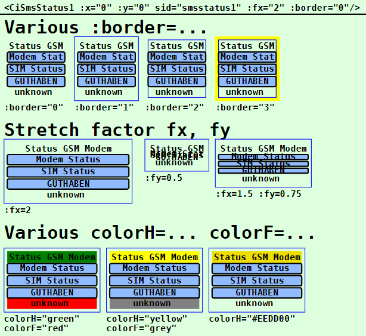
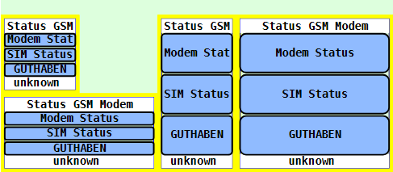

Last modified: 2023-03-15 <a name="up"></a>   
<table><tr><td></td><td>
<h1>Vue: Using the CiSmsStatus1 symbol</h1>
<a href="../../README.md">==> Home page</a> &nbsp; &nbsp; &nbsp; 
<a href="./LIESMICH.md">==> German version</a> &nbsp; &nbsp; &nbsp; 
</td></tr></table><hr>

# Target
Getting to know all the ways to display and use a `CiSmsStatus1` symbol.   
In general:   
* The `CiSmsStatus1` icon is used to query the status of a GSM module (e.g. SIM808 module GSM with GPS antenna for 3G 4G SIM card e.g. from [AliExpress](https://de.aliexpress.com/item/1005002384541464.html?spm=a2g0s.9042311.0.0.5c824c4dqUu43E) or [Amazon](https://www.amazon.de/dp/B09CM8TSX9/ref=sspa_dk_detail_0?psc=1&pd_rd_i=B09CM8TSX9&pd_rd_w=yNPjf&pf_rd_p=4f2ceb27-95e9-46ab-8808-db390b56ec01&pd_rd_wg=Muvvr&pf_rd_r=3NTH9ZQRZNE3VBZKD1YV&pd_rd_r=58ca39f9-b9f0-40b5-9b14-7f5d8a37ce1d&spLa=ZW5jcnlwdGVkUXVhbGlmaWVyPUEzN1A5OTA0NUNBTTA2JmVuY3J5cHRlZElkPUEwMzcxNzc3MlkxMFpaUTBTRjhYMSZlbmNyeXB0ZWRBZElkPUEwNzU2MTYzMjRJSlNTREJMTjVHSiZ3aWRnZXROYW1lPXNwX2RldGFpbCZhY3Rpb249Y2xpY2tSZWRpcmVjdCZkb05vdExvZ0NsaWNrPXRydWU=)).   
* If you click on the upper button of the `CiSmsStatus1` icon, the status of the GSM module and product name will be queried.   
* If you click on the middle button of the `CiSmsStatus1` icon, the status of the SIM card (provider) will be requested.   
* If you click on the lower button of the `CiSmsStatus1` icon, the SMS credit of the provider will be queried.   
* All properties concerning the graphical representation of the symbol are set in the `<template>` area of the representation file (e.g. in `CiMain.vue`).   
* All non-graphical properties, such as ID, name, labels and MQTT functionality, are defined in the `CiSmsStatus1Controller.ts` file.   

# Quick Reference
* Download directory `vuex530_ci_mqtt_smsstatus1`.   
* Start Visual Studio Code (VSC) with Vue 3 + TypeScript support and open the folder of this Vue application.   
* In VSC open the terminal and type the following:   
`npm run serve`   
* Start the browser (e.g. Google Chrome) and call the page `localhost:8080`.   

In the browser the symbols shown in _Fig. 1_ (see below) are displayed.   

If you want to test the MQTT functionality without a GSM modem, you have to run a MQTT broker (e.g. Mosquitto) on a computer (or Raspberry Pi) with the IP address `10.1.1.1`.   
* Connect the development computer to the network of the broker server. (For WLAN e.g. SSID `Raspi11`, password `12345678`)   
* Start Windows console (`cmd.exe`), change to the mosquitto directory and enter the following:   
`mosquitto_sub -h 10.1.1.1 -t "#" -v`   
* The CiSmsStatus1 icon waits for MQTT messages containing information about the GSM modem. For simulation, different response values can also be entered with the program `mosquitto_pub` in a Windows console:   
* `mosquitto_pub -h 10.1.1.1 -t sms/cmd/ret/module -m "{\"device\":\"/dev/ttyUSB0\",\"module\":true,\"product\":\"SIM808 R14.18\"}"`   
* `mosquitto_pub -h 10.1.1.1 -t sms/cmd/ret/sim -m "{\"provider\":\"T-Mobile A\",\"sim\":true,\"result\":\"^~+COPS: 0,0,'T-Mobile A'^~^~OK^~\"}"`   
* `mosquitto_pub -h 10.1.1.1 -t sms/cmd/ret/credit -m "{\"euro\":33.25}"`   

Note: A detailed description of individual steps can be found in other chapters of the MQTT4HOME project.

## Graphic representation of a symbol
## General
The coding of the graphical representation of a CI symbol `CiXxx` is done in a file with a name like `CiXxx.vue`. These files are then used by the actual project file (e.g. `CiMain.vue`) to display the web page.   
The following image shows the output of this Vue application with different `CiSmsStatus1` sizes. It can be seen that stretch factors smaller than 1 are not useful for the `CiSmsStatus1` symbol. Which attributes cause which display is described afterwards.     
   
_Fig. 1: Examples for different CiSmsStatus1 representations_.   

## Creating the CiSmsStatus1 symbol
The drawing of a CiSmsStatus1 symbol is done in the `<template>` area of the presentation file (e.g. in `CiMain.vue`) by the tag `<CiSmsStatus11>` and further attributes.   
_Example_:   
```   
<CiSmsStatus1 :x="50" :y="70"  sid="smsstatus1" :fx="1.5" :fy="1" colorH="white" colorF="white" :border="3"></CiSmsStatus1>
```   

## Positioning of a symbol (x, y)
Normally CI symbols are 100x100 units in size and the center point (50/50) is used to indicate the position (placement point). If the drawing area is defined e.g. by   
`<svg width="100%" viewBox="0 0 500 220">`   
then the location specification `:x="50" :y="70"` causes the CiSmsStatus1 symbol to border the left edge and be 20 units away from the top edge:   
   
_Fig. 2: Location of a CiSmsStatus1 symbol_   

_Note_:   
Remaining space at the bottom: 220 - 20 - 100 = 100 units.   
Remaining space right: 500 - 100 = 400 units   

## ID of a symbol (sid)
The symbol ID (sid) represents the connection of the graphical representation to the controller (see property [id](#id) in chapter "[Attributes defined in the base controller](#id)").

## Border of a symbol (:border)
All CI symbols are normally 100x100 units on the outside and have a fixed margin of 5 units on the inside. So the individual "workspace" of a symbol is 90x90 units.   
The margin makes it possible to arrange symbols directly next to each other in a 100-unit grid without the symbol drawings visually touching each other.   
If you want to display the border of a CI symbol, there are four possibilities for this, which are set via the attribute `:border=`:   

| Parameter | Meaning |   
| ------------- | ------------------------------ |   
| `:border="0"` | No border will be displayed. |   
| `:border="1"` | Only the outer border of the symbol is displayed (= total space required by the symbol). |   
| `:border="2"` | Only the inner border of the symbol is shown (= the drawing area for the symbol). |   
| `:border="3"` | The border of the symbol is displayed in yellow. |   

Default is `:border="1"`.   

## Text information in CiSmsStatus1 symbol
Each `CiSmsStatus1` symbol knows three areas for text output:   
* header   
* footer   
* Drawing area with the labels of the   
  * upper button   
  * middle button   
  * lower button.   

It applies: 
* The header contains the symbol name (or `sid`) defined in the controller.   
* The footer contains the feedback of the GSM modem.   
* The labels of the buttons are defined in the controller.   

## Stretching of a symbol (:fx, :fy)
By default, all symbols are 100x100 units in size. However, it is possible to stretch the symbols in x and in y direction. The placement point remains the same.   
Stretching is done by specifying the parameters `fx` and `fy`, as the following example shows:   
   
_Fig. 3: Stretched `CiSmsStatus1` symbol_   

## Color of a CiSmsStatus1 symbol (colorH, colorF, colorA1, colorA2, colorA3)
The attributes `colorH=` and `colorF=` can be used to select the background color of the header and footer (default: none = transparent). The value can either be an RGB value (red-green-blue value) like `#ffee00` or a text value like `red`, `green` etc..   
The color of the buttons can be selected using the attributes `colorA1=`, `colorA2=` and `colorA3=`. If you don't set any color, they will show the state of the data transmission from the GSM modem.   

<a name="id"></a>   
# Non-graphical attributes
## Attributes defined in the base controller.
Attributes of CI symbols that have nothing to do with the graphical representation of the symbol are defined in "`xxxController.ts`" files.   
The following attributes are defined in the base controller (`CiBaseController.ts` file) and must be mandatory in all derived controllers:   
| Property     | Meaning |   
| ------------ | ---------------------------------------- |   
| `id`         | Should normally be a unique name of a CiSmsStatus1 symbol.    |   
| `subTopic`   | Messages or MQTT topics the CiSmsStatus1 symbol "listens" to. |   
| `pubTopic`   | MQTT topics that the CiSmsStatus1 symbol sends when clicked. |   

The following attributes are optional:   
| property     | meaning                              |   
| ------------ | ------------------------------------ |   
| `name`       | Name of a CiSmsStatus1 symbol. Can be displayed in the header of the icon. |   
| `pubPayload` | Payload sent when the upper button of the CiSmsStatus1 symbol is pressed. |   

## Attributes defined in `CiSmsStatus1Controller.ts`.
The following attributes are mandatory:   
| Property          | Meaning                              |   
| ----------------- | ------------------------------------ |   
| `iSmsStatusState` | Status of the CiSmsStatus1 symbol. Use e.g. -99 as default for the start. |   

The following attributes are optional and can be used:   
| property      | meaning                              |   
| ------------- | ------------------------------------ |   
| `textUpper`   | Label of the upper button.           |   
| `textMiddle`  | Label of the middle button.          |   
| `textLower`   | Label of the lower button.           |   
| `pubTopic2`   | Topic that will be sent when pressing the middle button of the CiSmsStatus1 symbol. |   
| `pubPayload2` | Payload that will be sent when the middle button of the CiSmsStatus1 symbol is pressed. |   
| `pubTopic3`   | Topic that will be sent when pressing the lower button of the CiSmsStatus1 symbol. |   
| `pubPayload3` | Payload that will be sent when the lower button of the CiSmsStatus1 symbol is pressed. |   

## Example: Coding of the `CiSmsStatus1Controller.ts`.   
Normally only the values inside the `Array<SmsStatus1>` area need to be added.   

If you want to implement additional MQTT functionality when receiving messages, the code in the method `public onMessage (message: Message): void` can be extended accordingly.   

```
// ______CiSmsStatus1Controller.ts_______________khartinger_____
// 2023-03-12: new
import { reactive } from 'vue'
import { Message } from '@/services/CiMqttClient'
import { CiBaseController, IBase } from './CiBaseController'

export interface SmsStatus1 extends IBase {
  // ---------mandatory-----------------------------------------
  iSmsStatusState: number;
  // ---------optional------------------------------------------
  textUpper?: string;
  textMiddle?: string;
  textLower?: string;
  textFooter?: string;
  pubTopic2?: string;
  pubPayload2?: string;
  pubTopic3?: string;
  pubPayload3?: string;
  // Note: default pubPayload means pubPayloadUpper!
}

export class CiSmsStatus1Controller extends CiBaseController {
  public z2Mstatus1s: Array<SmsStatus1> = reactive(
    [
      {
        id: 'smsstatus1',
        name: 'Status GSM Modem',
        iSmsStatusState: -99,
        textUpper: 'Modem Status',
        textMiddle: 'SIM Status',
        textLower: 'GUTHABEN',
        subTopic: 'sms/cmd/ret/module sms/cmd/ret/sim sms/cmd/ret/credit',
        pubTopic: 'sms/cmd/get',
        pubPayload: 'module',
        pubTopic2: 'sms/cmd/get',
        pubPayload2: 'sim',
        pubTopic3: 'sms/cmd/get',
        pubPayload3: 'credit'
      }
    ]
  );

  // _________state constants___________________________________
  public maskSmsModule = 0x01;
  public maskSmsSim = 0x02;
  public maskSmsCredit = 0x04;
  public maskSmsValidModule = 0x10;
  public maskSmsValidSim = 0x20;
  public maskSmsValidCredit = 0x40;
  public maskSmsValidAny = 0x70;

  // _________react on incomming MQTT messages__________________
  public onMessage (message: Message): void {
    this.z2Mstatus1s.forEach(smsstatus1 => {
      const aSubTopic = smsstatus1.subTopic.split(' ')
      if (aSubTopic.includes(message.topic)) {
        // ========smsstatus1 found=============================
        if (smsstatus1.iSmsStatusState < 0) smsstatus1.iSmsStatusState = 0
        if (message.topic.includes('/ret/module')) {
          // ------module state---------------------------------
          try {
            // payload: {"device":"/dev/ttyUSB_Modem","module":true,"product":"SIM808 R14.18"}
            const aPayload = JSON.parse(message.payload)
            if (aPayload.module) {
              smsstatus1.textFooter = aPayload.device
              smsstatus1.iSmsStatusState |= this.maskSmsModule
            } else {
              smsstatus1.textFooter = 'No device'
              smsstatus1.iSmsStatusState &= ~this.maskSmsModule
            }
            smsstatus1.iSmsStatusState |= this.maskSmsValidModule
            console.log('i_=', smsstatus1.iSmsStatusState, ' -t ', message.topic, 'pay: ', aPayload)
          } catch (error) {
            smsstatus1.iSmsStatusState &= ~this.maskSmsValidModule
          }
        }
        if (message.topic.includes('/ret/sim')) {
          // ------sim state------------------------------------
          try {
            // payload: {"provider":"T-Mobile A","sim":true,"result":"^~+COPS: 0,0,'T-Mobile A'^~^~OK^~"}
            const aPayload = JSON.parse(message.payload)
            if (aPayload.sim) {
              smsstatus1.textFooter = aPayload.provider
              smsstatus1.iSmsStatusState |= this.maskSmsSim
            } else {
              smsstatus1.textFooter = 'No provider'
              smsstatus1.iSmsStatusState &= ~this.maskSmsSim
            }
            smsstatus1.iSmsStatusState |= this.maskSmsValidSim
          } catch (error) {
            smsstatus1.iSmsStatusState &= ~this.maskSmsValidSim
          }
        }
        if (message.topic.includes('/ret/credit')) {
          // ------sim state------------------------------------
          try {
            // payload: {"euro":33.25}
            const aPayload = JSON.parse(message.payload)
            if (aPayload.euro >= 0) {
              smsstatus1.textFooter = `${aPayload.euro}`
              smsstatus1.iSmsStatusState |= this.maskSmsCredit
            } else {
              smsstatus1.textFooter = 'No Info'
              smsstatus1.iSmsStatusState &= ~this.maskSmsCredit
            }
            smsstatus1.iSmsStatusState |= this.maskSmsValidCredit
          } catch (error) {
            smsstatus1.iSmsStatusState &= ~this.maskSmsValidCredit
          }
        }
      } // ===END of smsstatus1 found===========================
    })
  }

  // _________publish a MQTT message____________________________
  public publishCi (topic: string, payload: string): void {
    // console.log('CiSmsStatus11Controller:publishCi:', '-t ' + topic + ' -m ' + payload)
    this.publish(topic, payload, false, 0).catch((e) => { console.error('CiSmsStatus1Controller: ERROR:', e) })
  }
}

export const ciSmsStatus1Controller = new CiSmsStatus1Controller()
```

[Top of page](#up)
